# **Introduction**

# **Authors**

# **Outline**

# 1. Data

# 2. Predicting Train Delay Duration

This section investigates how much of the variance in train delay duration can be explained by observable operational and structural factors, and what the limits of predictability are.

Delay duration is defined as delay=max(delay_in_min,0) to exclude early arrivals from the reliability measure. 

Due to strong right-skewness and a large mass at zero, the dependent variable is transformed as log(1+delay).

## Model Specification and Assumption Diagnostics

We first estimate a log-linear regression using operational variables (departure hour, weekday, month, weekend indicator, and line position).

Residual diagnostics indicate:
- The log transformation substantially reduces skewness
- Mild right-skewness remains due to heavy-tailed delay events.
- Some heteroskedasticity persists, though reduced compared to the untransformed model.
- Residual normality is not fully satisfied in the tails, which is expected given the large sample size and extreme delay events.
- Overall, model assumptions are reasonably satisfied for predictive purposes, though extreme delays remain difficult to capture.

Diagnostic plots (residual distribution (Figure 1), residuals vs fitted (Figure 2), Q-Q plot (Figure 3)) are provided in the Appendix.

## Incremental Model Comparison

Three models are estimated:

- Model 1: Operational variables only → R² ≈ 0.04 
    - Variables: Train line station number (train_line_station_num), Departure Hour (dep_hour), Departure Day of Week (dep_dow), Departure Month (dep_month), Departure is on Weekend (is_weekend)
- Model 2: + Train type → R² ≈ 0.16
    - Variables: Train line station number (train_line_station_num), Departure Hour (dep_hour), Departure Day of Week (dep_dow), Departure Month (dep_month), Departure is on Weekend (is_weekend), Train type (train_type)
- Model 3: + Station identity → R² ≈ 0.21
    - Variables: Train line station number (train_line_station_num), Departure Hour (dep_hour), Departure Day of Week (dep_dow), Departure Month (dep_month), Departure is on Weekend (is_weekend), Train type (train_type), Station Name (station_name).

Model 3:

This suggests that operational timing alone explains little variation, and structural variables, especially train type and station, increase explanatory power. However, since the explained variance (0.21) is still quite low, we analyzed nonlinear effects using a Random Forest model. Here, the R² is approx. 0.26.

 The plot shows that nonlinear modeling improves performance moderately, suggesting interaction effects but no dramatic hidden structure.

## Model Fit and Predictability Limits

Observed vs. predicted plots reveal:
- Good performance for small and moderate delays.
- Systematic underprediction of large delays.
- Compression of predictions toward lower values.

Interpretation: 

- The model captures typical delay patterns but fails to predict extreme disruption events. 
- Large delays seem to be driven by factors not contained in schedule-based structural variables.

## Feature Importance

The permutation importance analysis shows three key findings:
- Station identity and train type are the dominant predictors.
- Temporal variables contribute less.
- Line position has moderate importance.

This suggests that duration is primarily structured by infrastructural and operational system characteristics rather than simple time-of-day effects.

## Conclusion

Observable operational and structural variables explain roughly 20–26% of the variation in train delay duration. Although delays show clear structural patterns across train types and stations, most of the variation cannot be explained using the available data. In particular, large delay events are difficult to predict, suggesting that additional unobserved factors, such as infrastructure disruptions, weather conditions, or network spillovers, play an important role in train delays.

# 3. DB Reliability Analysis: Factors Influencing Train Cancellations

This section analyzes the operational performance of Deutsche Bahn for October 2025.  
We examine how train categories, geography, and route progression impact service reliability using a dataset of over 1 million records.

## 3.1 Influence of Train Category

Analysis shows that **Metronom (ME)** and **Intercity (IC)** services face the highest cancellation risks, peaking at **7.36%** and **6.75%** respectively.  
Conversely, **Bus services** are the most reliable mode with a near-zero failure rate.

*Figure 3.1: Comparison of cancellation rates across major train categories.*

## 3.2 Temporal & Geographical "Blackspots"

#### Geographical Hubs
- **Hamburg Dammtor** is a significant outlier with a **27.56%** cancellation rate, identifying it as a critical infrastructure bottleneck.
#### The Wednesday Peak
- Service instability peaks on **Wednesdays (5.99%)**, suggesting mid-week operational strain.

*Figure 3.2: Mapping critical failure points across the German rail network.*

## 3.3 Operating Patterns & Rush Hour Collapse

The network experiences systemic pressure during the **Evening Rush Hour (18:00)**.  
While diversity in train types at hubs increases complexity, the inability to manage simultaneous peak-hour arrivals leads to localized collapses.

*Figure 3.3: Visualizing the performance dip of S-Bahn and ICE services during peak hours.*

## 3.4 Advanced Insight: The "Route Fatigue" Phenomenon

Cancellations are cumulative. Logistic regression confirms that as a train progresses through its **Stop Sequence**, the probability of termination increases significantly.
Every additional stop adds a layer of risk.

*Figure 3.4: Statistical proof of the correlation between stop number and cancellation risk.*

## 3.5 Key Findings Summary

| Factor        | Key Finding | Statistical Support (p-value) |
|--------------|------------|-------------------------------|
| **Train Type** | IC (6.75%) and S-Bahn (5.93%) are the most vulnerable. | Chi-Square p < 0.001 |
| **Time of Day** | Peak cancellations occur at 18:00. | Logistic Regression p < 0.001 |
| **Day of Week** | Wednesday is the most unstable day. | Chi-Square p < 0.001 |
| **Location** | Hamburg Dammtor (27.56%) is the primary failure point. | Chi-Square p < 0.001 |
| **Fatigue** | Risk increases as the Stop Sequence progresses. | Logistic Regression p < 0.001 |

## Conclusion

The data reveals that cancellations are not random but systemic. Metronom and IC trains, Hamburg Dammtor station, and Wednesday evenings consistently emerge as high-risk. Most tellingly, the Route Fatigue effect confirms that operational stress accumulates the further a train travels, the more likely it is to be cancelled. These patterns point to structural weaknesses that targeted scheduling and infrastructure investment could address.

# 4. RQ3

# **Train Reliability Analysis: Delay and Cancellation**

## 4.1 Introduction**

This report examines the relationship between train type, delay duration, and cancellation probability using a large-scale operational dataset. The objective is to evaluate whether train category influences service reliability and to determine whether delay severity increases cancellation risk.

The analysis combines descriptive statistics, visualization, ANOVA testing, Chi-square testing, and effect size estimation to provide both statistical significance and practical interpretation.

## 4.2. Does Train Type Influence Delay Duration?**

To evaluate whether delay duration differs across train types, both descriptive and inferential methods were applied.

### **Descriptive Evidence**

Average delay was calculated across train categories to assess performance differences. The analysis reveals substantial variation between train types, with NJ (23.1 minutes) and NEX (21.8 minutes) recording the highest average delays in the network.

### **Distribution Analysis**

To examine variability, a boxplot comparison was conducted for the top 10 most frequent train types.

**The distribution analysis reveals:**

• ICE and IC trains exhibit greater variability in delay duration.

• Regional services show comparatively tighter distributions.

• Some train types demonstrate extreme values, indicating unstable punctuality performance

### **ANOVA Test**

A one-way ANOVA was conducted to test whether mean delay differs significantly across train types.

F(54, 1,989,070) \= 4638.44

p \< 0.001

The results indicate a statistically significant difference in mean delay between train types.

### **Effect Size (Eta Squared)**

Eta² \= 0.1118

Approximately 11.18% of the total variance in delay duration is explained by train type.

This represents a moderate practical effect, suggesting that the train category plays a meaningful role in punctuality outcomes.

# 4.3. Is Delay Severity Associated with Cancellation?**

To examine whether increased delay leads to higher cancellation risk, delay duration was categorized into three levels:

• On-time/Early (≤5 minutes)

• Minor Delay (6–15 minutes)

• Severe Delay (\>15 minutes)

### **Crosstab Results**

| Delay Category | Not Canceled (%) | Canceled (%) |
| ----- | ----- | ----- |
| On-time/Early | 95.1% | 4.9% |
| Minor Delay | 97.6% | 2.4% |
| Severe Delay | 90.8% | 9.2% |

The heatmap clearly shows that trains with severe delays (\>15 minutes) experience the highest cancellation rate (9.2%).

### **Chi-Square Test**

χ² \= 10152.4

df \= 2

p \< 0.001

The Chi-square test confirms a statistically significant association between delay severity and cancellation.

### **Effect Size (Cramér’s V)**

Cramér’s V \= 0.0714

This indicates a small but statistically reliable association. While the effect size is modest, the relationship is meaningful given the large sample size.

# 4.4. Does Train Type Influence Cancellation Probability?**

Cancellation rate was calculated across train types.

Certain train types demonstrate higher cancellation risk, aligning partially with delay rankings.

This suggests that operational complexity linked to specific train categories contributes to reliability challenges.

# 4.5. Key Findings Summary**

| Factor | Key Finding | Statistical Support |
| ----- | ----- | ----- |
| Train Type → Delay | Significant difference in mean delay | ANOVA p \< 0.001 |
| Delay → Cancellation | Severe delays increase cancellation risk | Chi-square p \< 0.001 |
| Effect Strength | Moderate delay variance explained (11%) | Eta² \= 0.1118 |
| Association Strength | Small but significant link | Cramér’s V \= 0.071 |

# 4.6. Conclusion**

This study confirms that train type plays a significant role in determining delay duration, and that increased delay severity elevates cancellation probability.

While delay severity shows a strong statistical association with cancellation, the effect size suggests that additional operational factors likely contribute to service instability.

Overall, the analysis highlights structural reliability differences across train categories and provides empirical evidence supporting targeted operational improvements.

# 5. How do different station clusters perform based on delay and other factors? 

We transformed the data on train rides into a set of profiles for each of the 107 traced stations, which includes average delay, cancellation rate, amount of trains passing through, and maximum delay for each station. 

## Checking distribution of delays, cancellations and traffic volume

The distribution plots show that the majority of stations handle standard train volumes and keep average delays between 2 and 6 minutes. However, a small number of extreme outliers exist with exceptionally high traffic and severe delays.

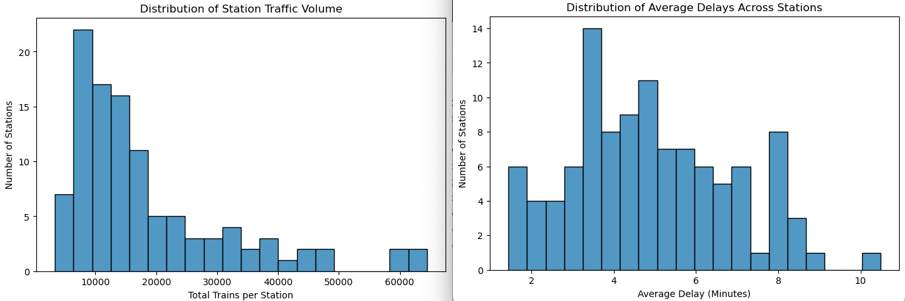

## Exploring correlation between delays and traffic volume

 Our assumption that high traffic volume alone does not cause high delays was confirmed by a Pearson correlation test with coefficient = -0.018. This means operational problems are linked to specific local conditions at the stations, rather than just their size. Distribution plotting showed skewed distribution, so data was normalised and scaled for further clustering of stations.

 ## Identifying clusters of stations

To group the stations by their operational performance, we applied Agglomerative hierarchical clustering, which showed 3 distinct cluster of stations.

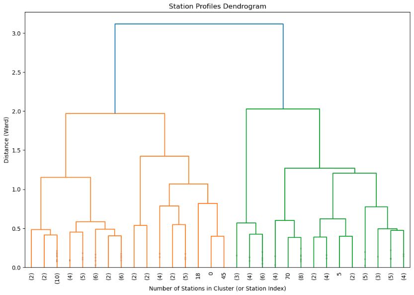

Based on this, we used Principal Component Analysis to chech how features contributed to clustering. We found that:
- the PCA explains 71% of variance, which is a strong result that our analysis can explain tendencies reliably
- cluster 1 tends to be the most efficient, having lower delay times, while clusters 2 and 3 have more delays and cancellations
- cluster 2 tends to include busier stations with more traffic than cluster 3, while cluster 1 includes both quiet and busy stations. 
This indicates an opportunity for comparing high-performing and low-performing stations of the same size and finding what is different between them.

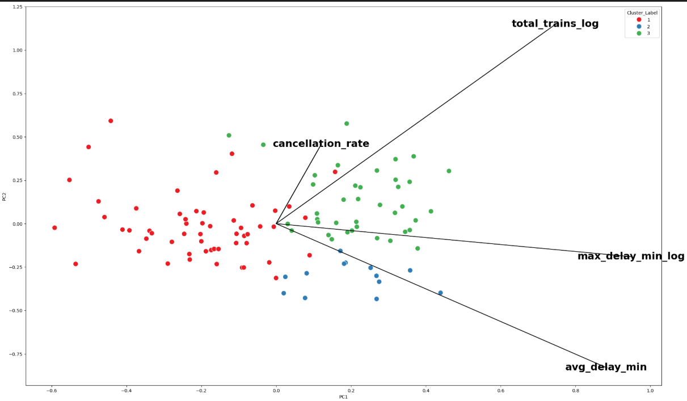

## Comparing profiles of station clusters

The clustering results show three distinct types of train stations based on their daily operations. A silhouette score of 0.25 confirms that these three groups are clearly separated and represent actual operational patterns in the railway network.

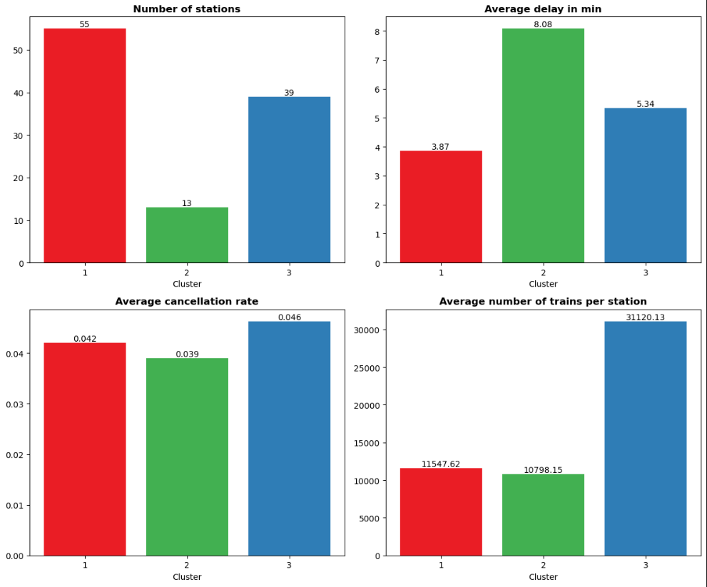

**Cluster 1** (55 stations): These stations handle an average of 11,547 trains and maintain the lowest average delay across the network at 3.87 minutes. This is also the largest group, including almost 50% of all stations in the dataset, which points at a relative reliability of the railway service. These stations can serve as example of best practices for stations in other clusters.

**Cluster 2** (13 stations): This small group (around 10% of all stations) represents severe outliers in punctuality. While they have the lowest average traffic volume of 10,798 trains, their average delay is the highest at 8.08 minutes. It is recommended to address this underperformance by investigating structural issues in the timetable or local infrastructure.

**Cluster 3** (39 stations): This group represents the major network hubs, accounting for around 40% of all stations. They handle almost three times the traffic volume of the other clusters at 31,120 trains on average, and they carry the highest average cancellation rate of 0.046. They are likely to have certain infrastructural challenges as well, since our analysis shows that traffic volume alone cannot explain high delays and cancellations.

## Comparing stations across regions

While our analysis is strictly limited to a sample of 107 monitored stations and does not represent the entirety of Germany's railway network, mapping these stations geographically reveals clear operational patterns. The standard stops in Cluster 1 and the major hubs in Cluster 3 closely follow the baseline distribution, with the highest station counts predictably located in heavily populated states like North Rhine-Westphalia, Bavaria, and Baden-Württemberg. 

In contrast, the underperforming stations in Cluster 2 show a distinct regional anomaly, as they are disproportionately concentrated in Lower Saxony rather than following the expected nationwide baseline. In particular, while Lower Saxony accounts for only 8% of the total monitored network, it contains nearly 40% of the heavily delayed stations, including Lüneburg.

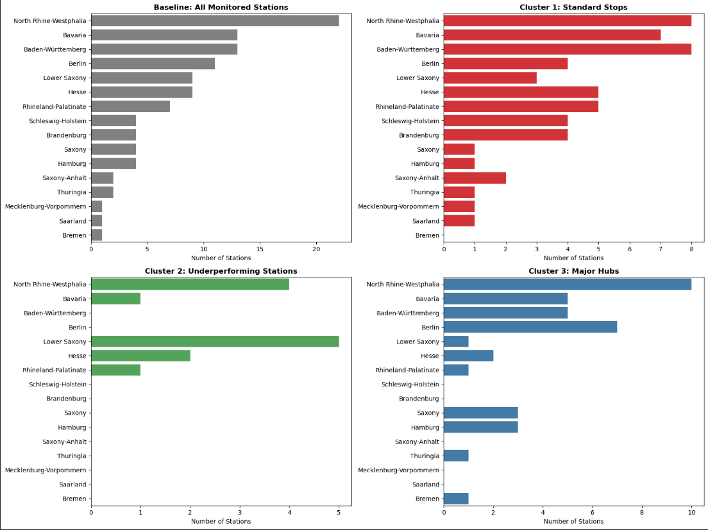

## Conclusion

Our analysis of 107 stations demonstrates that traffic volume is not the primary driver of delays, but rather specific operational profiles. Agglomerative clustering identified three distinct groups: low-delay stations (50%), underperforming stations (10%) and busy transport hubs (40%). A geographic mapping revealed a significant regional bottlenecks in Lower Saxony and North Rhine-Westphalia. These findings suggest that infrastructure investments should be prioritised in certain regions.

# 6. RQ5
# Structural Differences in Delay Distributions and Cancellation Risk in German Railway Operations

---

## 1. Introduction

The average delay does not sufficiently represent railway reliability. Instead, structural characteristics such as variability and extreme delay behavior may provide deeper insight. This study evaluates differences across train types and stations in delay distributions and examines how these structural differences relate to cancellation rates.

---

## 2. Train-Type Delay Structure

Delay distributions differ significantly across train types. Long-distance services such as ICE and IC exhibit higher median delays and larger interquartile ranges (IQR), indicating greater variability.

The 90th percentile (p90) highlights substantial tail behavior in certain categories. A large gap between the median and p90 suggests pronounced right-skewness and frequent extreme delays in long-distance operations.

**Figure 1:** Train-type delay structure (Median + IQR + p90 tail)  

---

## 3. Station-Level Delay Structure

Major hub stations display higher median delays and broader IQR values compared to smaller stations. Elevated p90 values suggest more frequent extreme delays in high-traffic locations.

Infrastructure complexity and traffic density appear to contribute to structural delay heterogeneity.

**Figure 2:** Station delay structure (Median + IQR + p90 tail)  

---

## 4. Tail Behavior Across Train Types

ECDF curves reveal differences in the overall distributional shape. Flatter curves indicate heavier tails and a higher probability of extreme delays beyond the global p90 threshold.

These findings confirm that differences extend beyond central tendency and reflect structural variation in delay distributions.

**Figure 3:** Delay tail behavior by train type (ECDF + global p90)  

---

## 5. Tail Risk and Cancellation Relationship

A weak positive relationship exists between tail delays (p90) and cancellation rates. Train types with heavier tails tend to have higher cancellation probabilities, but the association remains moderate (Spearman’s ρ ≈ 0.18).

This suggests that extreme delays contribute to cancellations, though additional operational factors also influence reliability.

**Figure 4:** Tail risk (p90) vs cancellation rate (train types)  

---

## 6. Statistical Evidence

- **Kruskal–Wallis Test:** Significant differences in delay distributions across train types (p < 0.05).
- **Distributional Metrics:** Clear variation in median, IQR, and p90 values.
- **Correlation Analysis:** Moderate positive association between tail delay and cancellation rate.

---

## 7. Key Findings

| Dimension | Result |
|------------|--------|
| Central Tendency | Median delay differs across train types and stations |
| Variability | IQR shows strong dispersion differences |
| Tail Behavior | ICE and major hubs exhibit heavier tails |
| Cancellation Link | Tail delay positively but moderately associated with cancellations |

---

## 8. Conclusion

Significant variability exists in delay distributions across train types and stations in terms of median values and dispersion. While extreme delays are positively associated with cancellation rates, the relationship is moderate, indicating that additional operational factors affect service reliability.
# Structural Differences in Delay Distributions and Cancellation Risk in German Railway Operations

---

## 1. Introduction

The average delay does not sufficiently represent railway reliability. Instead, structural characteristics such as variability and extreme delay behavior may provide deeper insight. This study evaluates differences across train types and stations in delay distributions and examines how these structural differences relate to cancellation rates.

---

## 2. Train-Type Delay Structure

Delay distributions differ significantly across train types. Long-distance services such as ICE and IC exhibit higher median delays and larger interquartile ranges (IQR), indicating greater variability.

The 90th percentile (p90) highlights substantial tail behavior in certain categories. A large gap between the median and p90 suggests pronounced right-skewness and frequent extreme delays in long-distance operations.

**Figure 1:** Train-type delay structure (Median + IQR + p90 tail)  
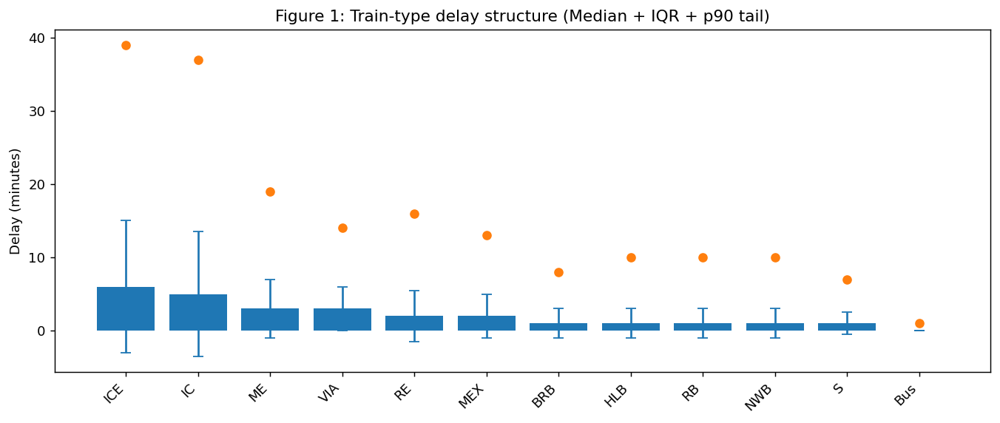

---

## 3. Station-Level Delay Structure

Major hub stations display higher median delays and broader IQR values compared to smaller stations. Elevated p90 values suggest more frequent extreme delays in high-traffic locations.

Infrastructure complexity and traffic density appear to contribute to structural delay heterogeneity.

**Figure 2:** Station delay structure (Median + IQR + p90 tail)  
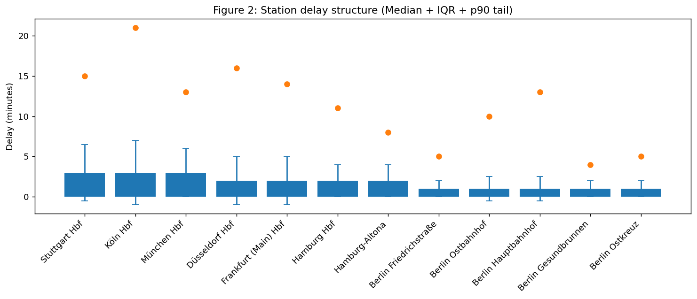

---

## 4. Tail Behavior Across Train Types

ECDF curves reveal differences in the overall distributional shape. Flatter curves indicate heavier tails and a higher probability of extreme delays beyond the global p90 threshold.

These findings confirm that differences extend beyond central tendency and reflect structural variation in delay distributions.

**Figure 3:** Delay tail behavior by train type (ECDF + global p90)  
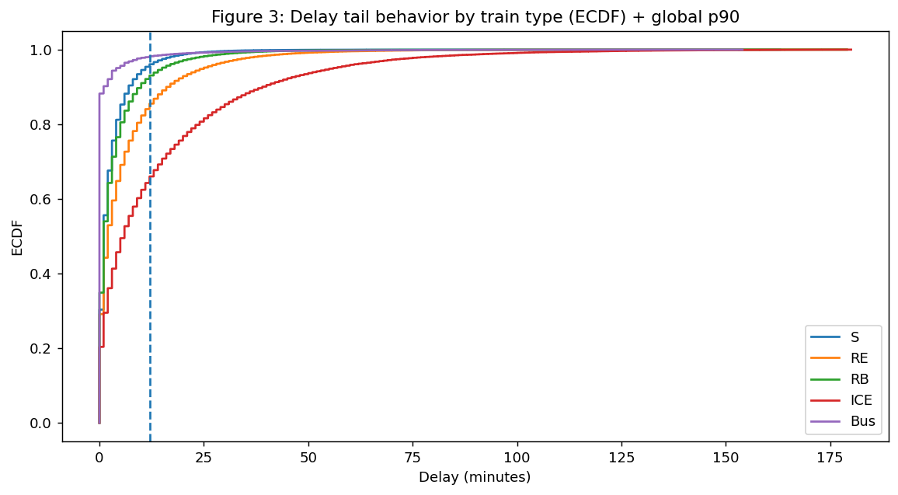

---

## 5. Tail Risk and Cancellation Relationship

A weak positive relationship exists between tail delays (p90) and cancellation rates. Train types with heavier tails tend to have higher cancellation probabilities, but the association remains moderate (Spearman’s ρ ≈ 0.18).

This suggests that extreme delays contribute to cancellations, though additional operational factors also influence reliability.

**Figure 4:** Tail risk (p90) vs cancellation rate (train types)  
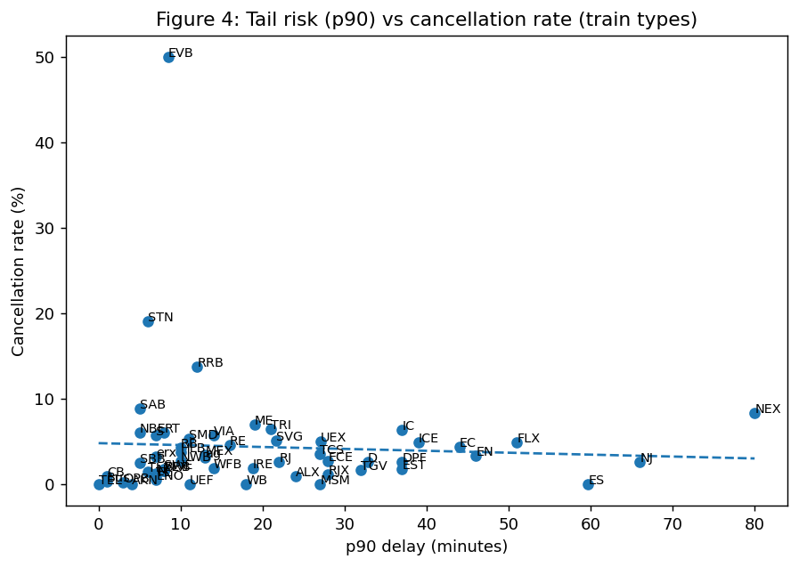

---

## 6. Statistical Evidence

- **Kruskal–Wallis Test:** Significant differences in delay distributions across train types (p < 0.05).
- **Distributional Metrics:** Clear variation in median, IQR, and p90 values.
- **Correlation Analysis:** Moderate positive association between tail delay and cancellation rate.

---

## 7. Key Findings

| Dimension | Result |
|------------|--------|
| Central Tendency | Median delay differs across train types and stations |
| Variability | IQR shows strong dispersion differences |
| Tail Behavior | ICE and major hubs exhibit heavier tails |
| Cancellation Link | Tail delay positively but moderately associated with cancellations |

---

## 8. Conclusion

Significant variability exists in delay distributions across train types and stations in terms of median values and dispersion. While extreme delays are positively associated with cancellation rates, the relationship is moderate, indicating that additional operational factors affect service reliability.

# RQ 6
## How does operational stress escalate across delay levels, time-of-day, and station-level congestion?

#### This section investigates whether operational instability in the German rail network follows an escalation pattern across delay magnitude, time-of-day, and station-level congestion. Specifically, we examine whether increasing delays systematically raise cancellation probability and whether peak-hour stress amplifies both delay volatility and spatial concentration of failures.
---
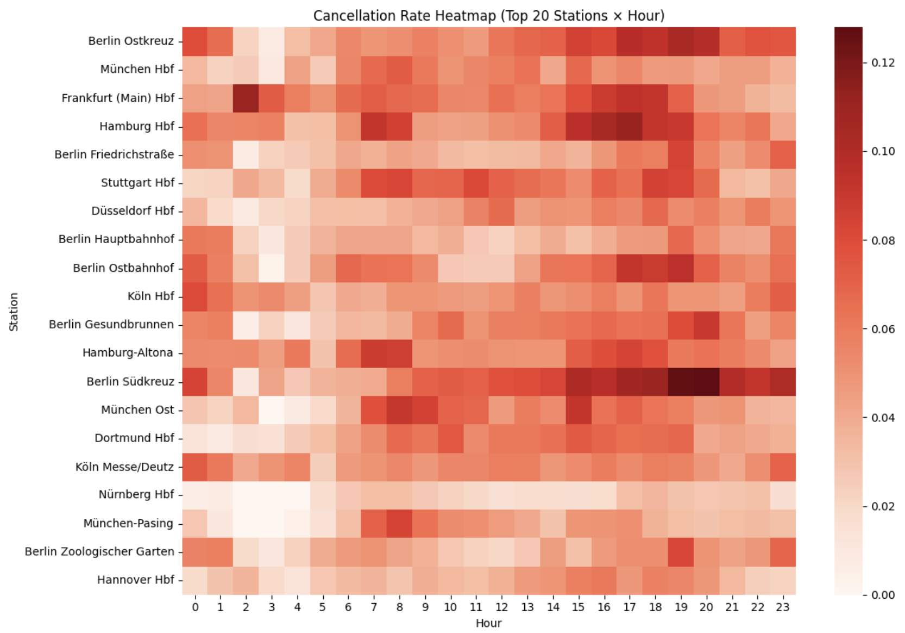
Key Observations

- Clear peak cancellation zones during late afternoon and early evening (15:00–19:00).

- Some stations consistently show higher cancellation intensity across most hours.

- Major hubs (e.g., Berlin Südkreuz, Hamburg Hbf) display pronounced evening spikes.

- Early morning hours generally show lower cancellation intensity.

Interpretation

- Cancellations are not evenly distributed.

- Instability concentrates in peak commuter periods.

- Certain stations act as persistent high-risk nodes, independent of hour.

- Suggests infrastructure saturation and network strain during high-demand windows.

---
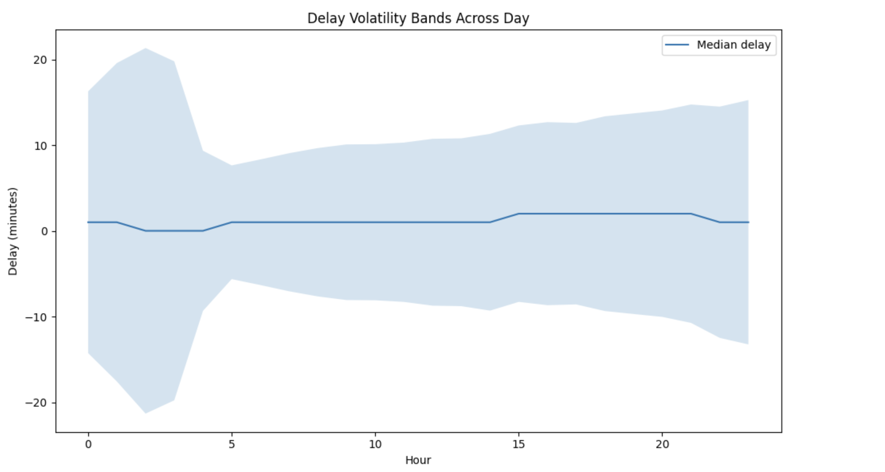
Key Observations

- Median delay remains relatively stable (around 0–2 minutes).

- However, delay dispersion widens significantly during daytime and evening.

- Early morning shows high variance, likely due to sparse traffic and occasional extreme events.

- Evening volatility expands again, indicating peak-hour instability.

Interpretation

- Reliability deterioration manifests more in variance expansion than median increase.

- Even if central delay stays moderate, unpredictability grows during peak periods.

- Increased volatility suggests a system operating near capacity limits.

---
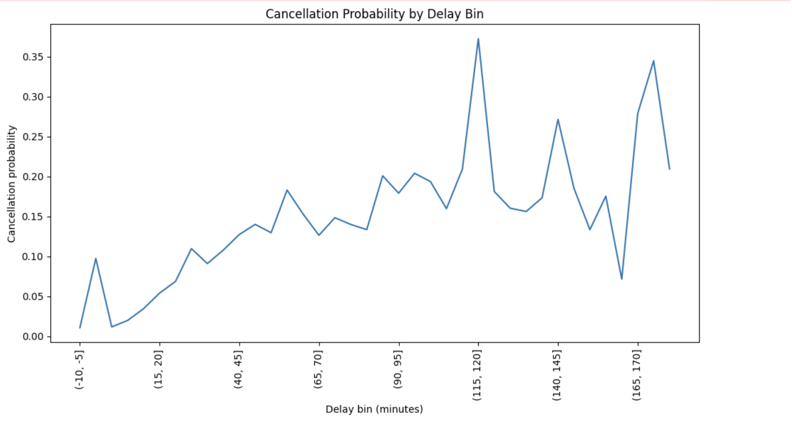
Key Observations

- Cancellation probability rises steadily as delay magnitude increases.

- Beyond moderate delay thresholds (~60–90 minutes), cancellation risk increases sharply.

- Extremely high delays (>120 min) show volatile but elevated cancellation probabilities.

- Non-zero cancellation probability even at small delays suggests preemptive cancellations.

Interpretation

- There appears to be a non-linear escalation pattern.

- The system likely operates with implicit operational thresholds beyond which cancellation becomes more efficient than recovery.

- Cancellation is not merely random but linked to accumulated operational stress.

# 8. Disclaimer on Methodogical Limitations

A disclaimer on methodogical limitations should be made, that since only a part of the total number of train stations in Germany is represented in the dataset, it is not possible to make conclusions for the rest of stations, especially for the regions underrepresented in the dataset.

# 9. Appendix

Figure 1: Residual distribution: .png)

Figure 2: Residuals vs Fitted: .png)

Figure 3: Q-Q Plot: .png)

