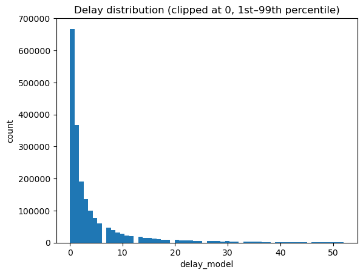
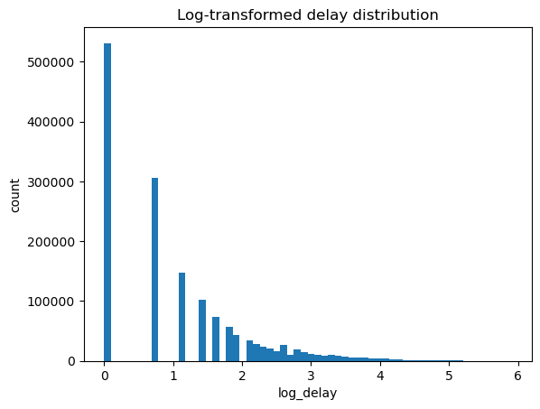
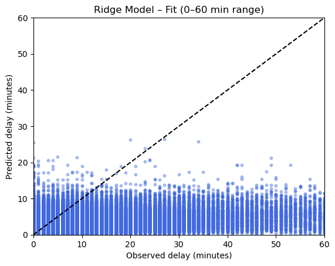
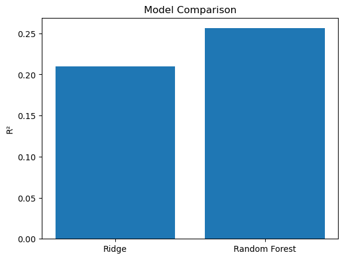
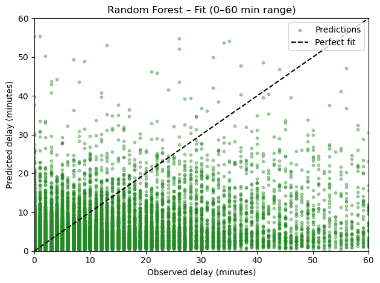
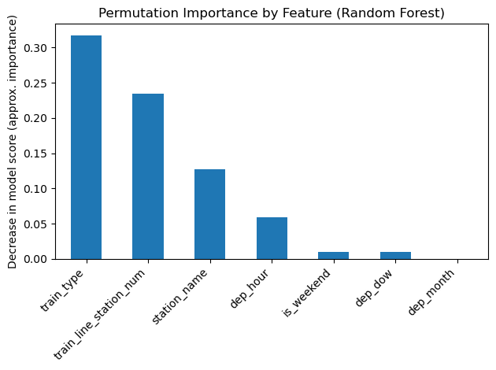
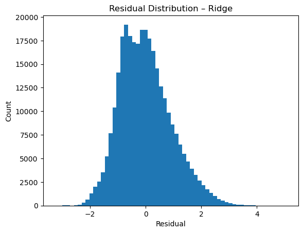
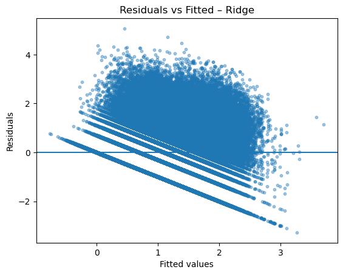
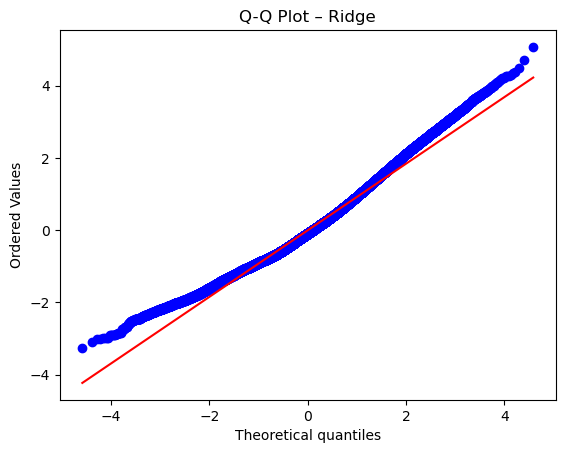

# **Introduction**

# **Authors**

# **Outline**

# 1. Data

# 2. Predicting Train Delay Duration

This section investigates how much of the variance in train delay duration can be explained by observable operational and structural factors, and what the limits of predictability are.

Delay duration is defined as delay=max(delay_in_min,0) to exclude early arrivals from the reliability measure. 

Due to strong right-skewness and a large mass at zero, the dependent variable is transformed as log(1+delay).

## Model Specification and Assumption Diagnostics

We first estimate a log-linear regression using operational variables (departure hour, weekday, month, weekend indicator, and line position).

Residual diagnostics indicate:
- The log transformation substantially reduces skewness
- Mild right-skewness remains due to heavy-tailed delay events.
- Some heteroskedasticity persists, though reduced compared to the untransformed model.
- Residual normality is not fully satisfied in the tails, which is expected given the large sample size and extreme delay events.
- Overall, model assumptions are reasonably satisfied for predictive purposes, though extreme delays remain difficult to capture.

Diagnostic plots (residual distribution (Figure 1), residuals vs fitted (Figure 2), Q-Q plot (Figure 3)) are provided in the Appendix.

## Incremental Model Comparison

Three models are estimated:

- Model 1: Operational variables only → R² ≈ 0.04 
    - Variables: Train line station number (train_line_station_num), Departure Hour (dep_hour), Departure Day of Week (dep_dow), Departure Month (dep_month), Departure is on Weekend (is_weekend)
- Model 2: + Train type → R² ≈ 0.16
    - Variables: Train line station number (train_line_station_num), Departure Hour (dep_hour), Departure Day of Week (dep_dow), Departure Month (dep_month), Departure is on Weekend (is_weekend), Train type (train_type)
- Model 3: + Station identity → R² ≈ 0.21
    - Variables: Train line station number (train_line_station_num), Departure Hour (dep_hour), Departure Day of Week (dep_dow), Departure Month (dep_month), Departure is on Weekend (is_weekend), Train type (train_type), Station Name (station_name).

Model 3:

This suggests that operational timing alone explains little variation, and structural variables, especially train type and station, increase explanatory power. However, since the explained variance (0.21) is still quite low, we analyzed nonlinear effects using a Random Forest model. Here, the R² is approx. 0.26.

 The plot shows that nonlinear modeling improves performance moderately, suggesting interaction effects but no dramatic hidden structure.

## Model Fit and Predictability Limits

Observed vs. predicted plots reveal:
- Good performance for small and moderate delays.
- Systematic underprediction of large delays.
- Compression of predictions toward lower values.

Interpretation: 

- The model captures typical delay patterns but fails to predict extreme disruption events. 
- Large delays seem to be driven by factors not contained in schedule-based structural variables.

## Feature Importance

The permutation importance analysis shows three key findings:
- Station identity and train type are the dominant predictors.
- Temporal variables contribute less.
- Line position has moderate importance.

This suggests that duration is primarily structured by infrastructural and operational system characteristics rather than simple time-of-day effects.

## Conclusion

Observable operational and structural variables explain roughly 20–26% of the variation in train delay duration. Although delays show clear structural patterns across train types and stations, most of the variation cannot be explained using the available data. In particular, large delay events are difficult to predict, suggesting that additional unobserved factors, such as infrastructure disruptions, weather conditions, or network spillovers, play an important role in train delays.

# 3. DB Reliability Analysis: Factors Influencing Train Cancellations

This section analyzes the operational performance of Deutsche Bahn for October 2025.  
We examine how train categories, geography, and route progression impact service reliability using a dataset of over 1 million records.

## 3.1 Influence of Train Category

Analysis shows that **Metronom (ME)** and **Intercity (IC)** services face the highest cancellation risks, peaking at **7.36%** and **6.75%** respectively.  

Conversely, **Bus services** are the most reliable mode with a near-zero failure rate.

*Figure 3.1: Comparison of cancellation rates across major train categories.*

---

## 3.2 Temporal & Geographical "Blackspots"

### Geographical Hubs

- **Hamburg Dammtor** is a significant outlier with a **27.56%** cancellation rate, identifying it as a critical infrastructure bottleneck.

### The Wednesday Peak

- Service instability peaks on **Wednesdays (5.99%)**, suggesting mid-week operational strain.

*Figure 3.2: Mapping critical failure points across the German rail network.*

---

## 3.3 Operating Patterns & Rush Hour Collapse

The network experiences systemic pressure during the **Evening Rush Hour (18:00)**.  

While diversity in train types at hubs increases complexity, the inability to manage simultaneous peak-hour arrivals leads to localized collapses.

*Figure 3.3: Visualizing the performance dip of S-Bahn and ICE services during peak hours.*

---

## 3.4 Advanced Insight: The "Route Fatigue" Phenomenon

Cancellations are cumulative. Logistic regression confirms that as a train progresses through its **Stop Sequence**, the probability of termination increases significantly.

Every additional stop adds a layer of risk.

*Figure 3.4: Statistical proof of the correlation between stop number and cancellation risk.*

---

## 3.5 Key Findings Summary

| Factor        | Key Finding | Statistical Support (p-value) |
|--------------|------------|-------------------------------|
| **Train Type** | IC (6.75%) and S-Bahn (5.93%) are the most vulnerable. | Chi-Square p < 0.001 |
| **Time of Day** | Peak cancellations occur at 18:00. | Logistic Regression p < 0.001 |
| **Day of Week** | Wednesday is the most unstable day. | Chi-Square p < 0.001 |
| **Location** | Hamburg Dammtor (27.56%) is the primary failure point. | Chi-Square p < 0.001 |
| **Fatigue** | Risk increases as the Stop Sequence progresses. | Logistic Regression p < 0.001 |

---

# 4. RQ3

# **Train Reliability Analysis: Delay and Cancellation**

## 4.1 Introduction**

This report examines the relationship between train type, delay duration, and cancellation probability using a large-scale operational dataset. The objective is to evaluate whether train category influences service reliability and to determine whether delay severity increases cancellation risk.

The analysis combines descriptive statistics, visualization, ANOVA testing, Chi-square testing, and effect size estimation to provide both statistical significance and practical interpretation.

## 4.2. Does Train Type Influence Delay Duration?**

To evaluate whether delay duration differs across train types, both descriptive and inferential methods were applied.

### **Descriptive Evidence**

Average delay was calculated across train categories to assess performance differences. The analysis reveals substantial variation between train types, with NJ (23.1 minutes) and NEX (21.8 minutes) recording the highest average delays in the network.

### **Distribution Analysis**

To examine variability, a boxplot comparison was conducted for the top 10 most frequent train types.

**The distribution analysis reveals:**

• ICE and IC trains exhibit greater variability in delay duration.

• Regional services show comparatively tighter distributions.

• Some train types demonstrate extreme values, indicating unstable punctuality performance

### **ANOVA Test**

A one-way ANOVA was conducted to test whether mean delay differs significantly across train types.

F(54, 1,989,070) \= 4638.44

p \< 0.001

The results indicate a statistically significant difference in mean delay between train types.

### **Effect Size (Eta Squared)**

Eta² \= 0.1118

Approximately 11.18% of the total variance in delay duration is explained by train type.

This represents a moderate practical effect, suggesting that the train category plays a meaningful role in punctuality outcomes.

# 4.3. Is Delay Severity Associated with Cancellation?**

To examine whether increased delay leads to higher cancellation risk, delay duration was categorized into three levels:

• On-time/Early (≤5 minutes)

• Minor Delay (6–15 minutes)

• Severe Delay (\>15 minutes)

### **Crosstab Results**

| Delay Category | Not Canceled (%) | Canceled (%) |
| ----- | ----- | ----- |
| On-time/Early | 95.1% | 4.9% |
| Minor Delay | 97.6% | 2.4% |
| Severe Delay | 90.8% | 9.2% |

The heatmap clearly shows that trains with severe delays (\>15 minutes) experience the highest cancellation rate (9.2%).

### **Chi-Square Test**

χ² \= 10152.4

df \= 2

p \< 0.001

The Chi-square test confirms a statistically significant association between delay severity and cancellation.

### **Effect Size (Cramér’s V)**

Cramér’s V \= 0.0714

This indicates a small but statistically reliable association. While the effect size is modest, the relationship is meaningful given the large sample size.

# 4.4. Does Train Type Influence Cancellation Probability?**

Cancellation rate was calculated across train types.

Certain train types demonstrate higher cancellation risk, aligning partially with delay rankings.

This suggests that operational complexity linked to specific train categories contributes to reliability challenges.

# 4.5. Key Findings Summary**

| Factor | Key Finding | Statistical Support |
| ----- | ----- | ----- |
| Train Type → Delay | Significant difference in mean delay | ANOVA p \< 0.001 |
| Delay → Cancellation | Severe delays increase cancellation risk | Chi-square p \< 0.001 |
| Effect Strength | Moderate delay variance explained (11%) | Eta² \= 0.1118 |
| Association Strength | Small but significant link | Cramér’s V \= 0.071 |

# 4.6. Conclusion**

This study confirms that train type plays a significant role in determining delay duration, and that increased delay severity elevates cancellation probability.

While delay severity shows a strong statistical association with cancellation, the effect size suggests that additional operational factors likely contribute to service instability.

Overall, the analysis highlights structural reliability differences across train categories and provides empirical evidence supporting targeted operational improvements.

# 5. RQ4 

# 6. RQ5

# 7. RQ 6

# 8. Appendix

Figure 1: Residual distribution: .png)

Figure 2: Residuals vs Fitted: .png)

Figure 3: Q-Q Plot: .png)

