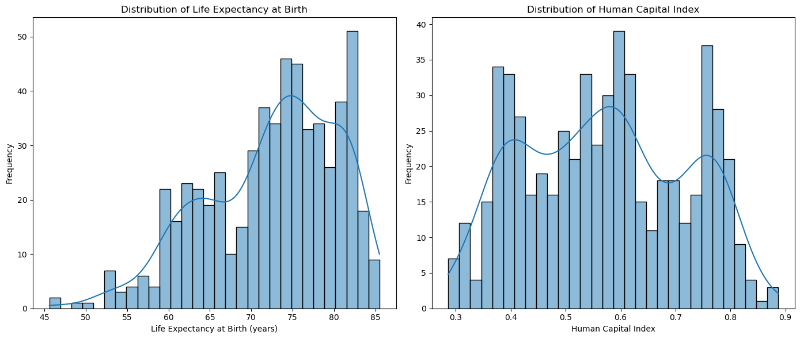
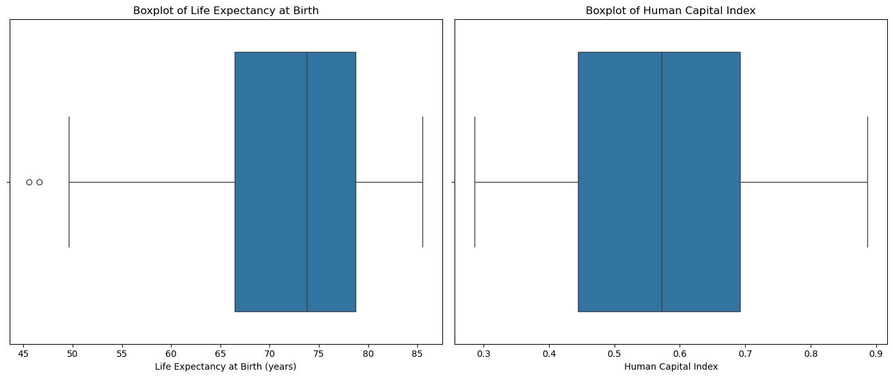
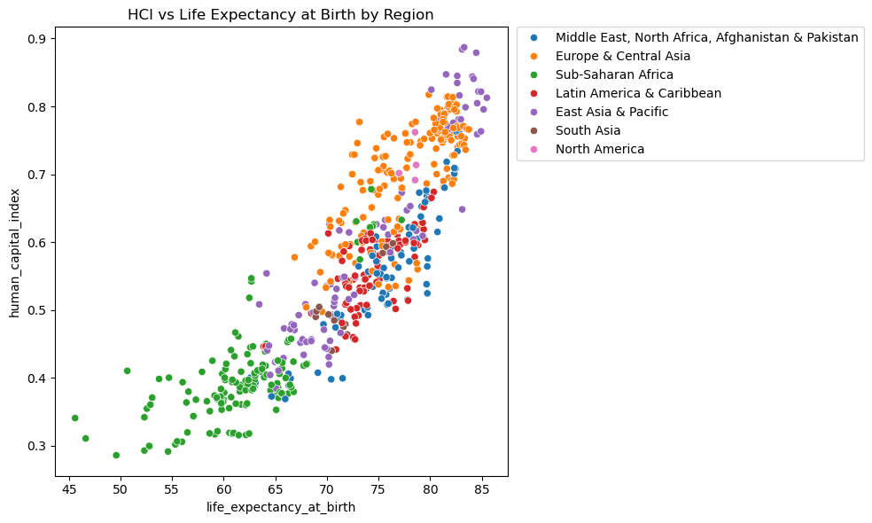

**World Bank Project Report**

**Authors of the report**

| Name | Contribution |
| :---- | :---- |
| Megan Kelly-Ortiz | Report, Research Question 2 |
| Kush Shah | Relationship between GDP and CO2 emissions |
|  |  |
|  |  |
|  |  |
|  |  |

## 1. Detailed Overview

  
<strong>Click to collapse/expand the full dataset structure</strong>

  

| Item | Description |
| :---- | :---- |
| Dataset name | World Bank Development Indicators |
| Number of rows |  17272 |
| Number of columns | 50  |
| Format file (.csv, .txt, etc) | .csv  |
| Authors of the dataset |  World Bank Group |
| Source (name) |  World Bank Group  |
| Source (link) |  https://github.com/datagus/ASDA2025/tree/main/datasets/homework_week5 |

   

  

## 2. Dataset Structure

  
<strong>Click to collapse/expand the full dataset structure</strong>

  

| Feature/variable                          | Data type   | Number of Unique values | Example values                                                                                                                               |
|:------------------------------------------|:------------|------------------------:|:---------------------------------------------------------------------------------------------------------------------------------------------|
| country                                   | object      | 203 | Afghanistan, Albania, Algeria, Angola, Antigua and Barbuda |
| date                                      | object      | 62 | 1960-01-01, 1961-01-01, 1962-01-01, 1963-01-01, 1964-01-01 |
| agricultural_land%                        | float64     | 7634 | 57.88, 57.96, 58.03, 58.12, 58.12 |
| forest_land%                              | float64     | 4834 | 1.85, 28.79, 28.72, 28.65, 28.57 |
| land_area                                 | float64     | 724 | 652230.00, 27400.00, 2381740.00, 2381741.00, 1246700.00 |
| avg_precipitation                         | float64     | 175 | 327.00, 1485.00, 89.00, 1010.00, 1030.00 |
| trade_in_services%                        | float64     | 6669 | 5.94, 4.93, 5.61, 20.21, 20.56 |
| control_of_corruption_estimate            | float64     | 4226 | -1.29, -1.18, -1.27, -1.25, -1.34 |
| control_of_corruption_std                 | float64     | 2436 | 0.34, 0.32, 0.35, 0.35, 0.27 |
| access_to_electricity%                    | float64     | 3062 | 4.45, 9.29, 14.13, 18.97, 23.81 |
| renewable_energy_consumption%             | float64     | 3824 | 23.00, 23.69, 27.38, 28.50, 30.14 |
| electric_power_consumption                | float64     | 5628 | 532.03, 568.40, 593.45, 591.03, 739.35 |
| CO2_emisions                              | float64     | 5535 | 2046.87, 1941.37, 1525.47, 1527.89, 1493.59 |
| other_greenhouse_emisions                 | float64     | 5641 | 11630.80, 11899.99, 11548.26, 11678.76, 11733.05 |
| population_density                        | float64     | 11003 | 13.48, 13.75, 14.04, 14.34, 14.67 |
| inflation_annual%                         | float64     | 8093 | 12.69, 6.78, 8.68, 26.42, -6.81 |
| real_interest_rate                        | float64     | 4173 | 10.05, -3.59, 12.56, 17.54, 11.36 |
| risk_premium_on_lending                   | float64     | 2192 | 9.69, 6.18, 6.15, 0.11, 4.08 |
| research_and_development_expenditure%     | float64     | 2162 | 0.09, 0.15, 0.23, 0.37, 0.20 |
| central_goverment_debt%                   | float64     | 1766 | 35.76, 37.48, 53.11, 55.57, 69.64 |
| tax_revenue%                              | float64     | 4142 | 6.97, 5.28, 6.09, 8.48, 9.17 |
| expense%                                  | float64     | 3952 | 20.58, 24.24, 50.72, 44.32, 50.86 |
| goverment_effectiveness_estimate          | float64     | 4109 | -2.18, -2.10, -2.17, -1.59, -1.18 |
| goverment_effectiveness_std               | float64     | 1606 | 0.19, 0.30, 0.33, 0.26, 0.30 |
| human_capital_index                       | float64     | 559 | 0.39, 0.39, 0.40, 0.54, 0.62 |
| doing_business                            | float64     | 179 | 173.00, 82.00, 157.00, 177.00, 113.00 |
| time_to_get_operation_license             | float64     | 232 | 13.80, 13.70, 21.20, 12.20, 10.90 |
| statistical_performance_indicators        | float64     | 1006 | 37.22, 42.58, 49.84, 49.76, 54.40 |
| individuals_using_internet%               | float64     | 4384 | 0.00, 0.00, 0.00, 0.09, 0.11 |
| logistic_performance_index                | float64     | 507 | 1.21, 2.24, 2.30, 2.07, 2.14 |
| military_expenditure%                     | float64     | 7125 | 1.63, 1.87, 1.61, 1.72, 2.05 |
| GDP_current_US                            | float64     | 9602 | 537777811.11, 548888895.56, 546666677.78, 751111191.11, 800000044.44 |
| political_stability_estimate              | float64     | 4219 | -2.42, -2.43, -2.44, -2.04, -2.20 |
| political_stability_std                   | float64     | 555 | 0.47, 0.44, 0.45, 0.44, 0.35 |
| rule_of_law_estimate                      | float64     | 4292 | -1.79, -1.73, -1.78, -1.67, -1.56 |
| rule_of_law_std                           | float64     | 2430 | 0.35, 0.33, 0.29, 0.30, 0.30 |
| regulatory_quality_estimate               | float64     | 4212 | -2.09, -2.06, -2.08, -1.81, -1.46 |
| regulatory_quality_std                    | float64     | 1510 | 0.39, 0.44, 0.42, 0.30, 0.24 |
| government_expenditure_on_education%      | float64     | 4592 | 1.16, 1.12, 1.43, 1.30, 1.74 |
| government_health_expenditure%            | float64     | 3721 | 0.08, 0.65, 0.54, 0.53, 0.50 |
| multidimensional_poverty_headcount_ratio% | float64     | 264 | 51.70, 49.40, 51.80, 49.00, 46.20 |
| gini_index                                | float64     | 369 | 27.00, 31.70, 30.60, 30.00, 29.00 |
| birth_rate                                | float64     | 8499 | 50.34, 50.44, 50.57, 50.70, 50.83 |
| death_rate                                | float64     | 7189 | 31.92, 31.35, 30.84, 30.36, 29.87 |
| life_expectancy_at_birth                  | float64     | 11081 | 32.53, 33.07, 33.55, 34.02, 34.49 |
| population                                | float64     | 12303 | 8622466.00, 8790140.00, 8969047.00, 9157465.00, 9355514.00 |
| rural_population                          | float64     | 11792 | 7898093.00, 8026804.00, 8163985.00, 8308019.00, 8458694.00 |
| voice_and_accountability_estimate         | float64     | 4313 | -1.91, -2.04, -2.03, -1.43, -1.18 |
| voice_and_accountability_std              | float64     | 2329 | 0.26, 0.26, 0.25, 0.19, 0.21 |
| intentional_homicides                     | float64     | 3702 | 4.07, 3.49, 4.21, 6.39, 9.98 |
| Income_group                              | object      | 4 | Low income, Upper middle income, Lower middle income, High income |
| Region                                    | object      | 7 | Middle East, North Africa, Afghanistan & Pakistan, Europe & Central Asia, Sub-Saharan Africa, Latin America & Caribbean, East Asia & Pacific |

  

## 2. Data Cleaning

  
<strong>Click to collapse/expand the full dataset structure</strong>

  

| Issue | Names of Columns affected | Description of the Issue | Action Taken |
| :---- | :---- | :---- | :---- |
| Inconsistent column labeling |  Income group  |  space  |  renamed to "Income_group"  |
| Wrong data types | year, population, GDP_current_US, inflation_annual%  | Loaded as strings instead of numeric (due to commas, missing values, or formatting)  | Converted to numeric using pd.to_numeric(errors="coerce")  |
| Missing values |  Income_group, life_expectancy_at_birth  |  missing values  |  dropped missing values  |
| Duplicates |  Entire Dataset | Some rows were duplicated across years/countries after concatenation  | Removed duplicates using drop_duplicates()  |
| Inconsistent categories |  Region, Income_group |  Region labels and income groups had inconsistent formatting (spaces, mixed cases, long labels) | Standardized categories (trimmed spaces, applied title case, replaced long categories with consistent region names)  |

  

## 4. Descriptive statistics

**Numeric columns**

  
<strong>Click to collapse/expand descriptive statistics</strong>

  

|                                           |   count |             mean |              std |            min |              25% |              50% |              75% |             max |
|:------------------------------------------|--------:|-----------------:|-----------------:|---------------:|-----------------:|-----------------:|-----------------:|----------------:|
| agricultural_land%                        |   10872 |     36.86        |     22.43        |    0.26        |     17.77        |     37.65        |     54.71        |    93.44        |
| forest_land%                              |    6171 |     32.02        |     24.66        |    0           |     10.88        |     30.27        |     50.85        |    98.57        |
| land_area                                 |   11016 | 633316           |      1.70094e+06 |   10           |  14870           | 107400           | 472710           |     1.639e+07   |
| avg_precipitation                         |    9587 |   1197.78        |    801.4         |   18.1         |    589           |   1083           |   1732           |  3240           |
| trade_in_services%                        |    6669 |     23.64        |     25.05        |    0.62        |      9.82        |     16.2         |     27.78        |   327.17        |
| control_of_corruption_estimate            |    4303 |     -0.02        |      1           |   -1.94        |     -0.8         |     -0.26        |      0.67        |     2.46        |
| control_of_corruption_std                 |    4303 |      0.2         |      0.08        |    0.11        |      0.15        |      0.17        |      0.22        |     0.94        |
| access_to_electricity%                    |    5676 |     80.97        |     29.64        |    0.53        |     70.46        |     99.09        |    100           |   100           |
| renewvable_energy_consumption%            |    6147 |     30.65        |     30.38        |    0           |      3.72        |     19.78        |     53.02        |    98.34        |
| electric_power_consumption                |    5628 |   3253.94        |   4510.36        |    5.55        |    442.24        |   1637.8         |   4399.79        | 54799.2         |
| CO2_emisions                              |    5641 | 145020           | 670469           |    0           |   1568.5         |   9402.05        |  57681.2         |     1.09447e+07 |
| other_greenhouse_emisions                 |    5641 | 200650           | 822148           |    7.62        |   6794.5         |  27683.9         |  89439.8         |     1.29429e+07 |
| population_density                        |   11016 |    289.18        |   1358.2         |    0.14        |     18.66        |     63.87        |    157.23        | 21594.8         |
| inflation_annual%                         |    8093 |     24.05        |    336.1         |  -17.64        |      2.09        |      4.7         |     10.02        | 23773.1         |
| real_interest_rate                        |    4173 |      5.68        |     15.77        |  -97.69        |      1.89        |      5.68        |      9.84        |   628.32        |
| risk_premium_on_lending                   |    2281 |      5.95        |      7.19        |  -31.5         |      2.6         |      4.62        |      7.25        |    67.84        |
| research_and_development_expenditure%     |    2179 |      0.96        |      0.97        |    0.01        |      0.24        |      0.59        |      1.4         |     5.71        |
| central_goverment_debt%                   |    1766 |     59.64        |     72.64        |   -1.17        |     30.76        |     49.63        |     74.55        |  2002.51        |
| tax_revenue%                              |    4142 |     17.09        |      7.8         |    0.04        |     11.98        |     16.5         |     21.68        |   147.64        |
| expense%                                  |    3952 |     26.87        |     12.75        |    2.81        |     17.21        |     25.51        |     34.5         |   210.21        |
| goverment_effectiveness_estimate          |    4279 |     -0.02        |      0.99        |   -2.44        |     -0.76        |     -0.17        |      0.68        |     2.47        |
| goverment_effectiveness_std               |    4279 |      0.24        |      0.07        |    0.16        |      0.2         |      0.22        |      0.25        |     0.88        |
| human_capital_index                       |     580 |      0.57        |      0.15        |    0.29        |      0.44        |      0.57        |      0.69        |     0.89        |
| doing_business                            |     179 |     94.45        |     54.56        |    1           |     47.5         |     95           |    140.5         |   189           |
| time_to_get_operation_license             |     302 |     31.26        |     30.35        |    1.2         |     13.27        |     22.05        |     37.02        |   176.1         |
| statistical_performance_indicators        |    1008 |     63.54        |     17.55        |   13.51        |     51.99        |     62.93        |     78.56        |    93.47        |
| individuals_using_internet%               |    6077 |     24.81        |     30.32        |    0           |      0.2         |      7.94        |     46           |   100           |
| logistic_performance_index                |     894 |      2.86        |      0.59        |    1.21        |      2.41        |      2.72        |      3.24        |     4.23        |
| military_expenditure%                     |    7126 |      2.73        |      3.21        |    0           |      1.2         |      1.89        |      3.17        |   117.35        |
| GDP_current_US                            |    9608 |      1.9504e+11  |      1.02821e+12 |    8.82474e+06 |      1.54897e+09 |      8.13377e+09 |      5.4234e+10  |     2.33151e+13 |
| political_stability_estimate              |    4312 |     -0.02        |      0.98        |   -3.18        |     -0.65        |      0.06        |      0.81        |     1.96        |
| political_stability_std                   |    4312 |      0.28        |      0.07        |    0.19        |      0.23        |      0.25        |      0.31        |     0.66        |
| rule_of_law_estimate                      |    4356 |     -0.03        |      0.98        |   -2.1         |     -0.8         |     -0.18        |      0.75        |     2.12        |
| rule_of_law_std                           |    4356 |      0.2         |      0.09        |    0.12        |      0.15        |      0.17        |      0.2         |     0.83        |
| regulatory_quality_estimate               |    4281 |     -0.02        |      0.99        |   -2.53        |     -0.72        |     -0.14        |      0.71        |     2.25        |
| regulatory_quality_std                    |    4281 |      0.23        |      0.07        |    0.15        |      0.19        |      0.21        |      0.25        |     0.89        |
| government_expenditure_on_education%      |    4606 |      4.38        |      1.96        |    0.62        |      3.07        |      4.24        |      5.39        |    44.33        |
| government_health_expenditure%            |    3722 |      3.29        |      2.35        |    0.06        |      1.53        |      2.67        |      4.57        |    22.25        |
| multidimensional_poverty_headcount_ratio% |     433 |     26.86        |     10.71        |    2.37        |     18.5         |     24.8         |     32.6         |    74.2         |
| gini_index                                |    2032 |     37.7         |      8.9         |   20.7         |     31.1         |     35.5         |     43           |    65.8         |
| birth_rate                                |   12315 |     27.9         |     13.04        |    5           |     16           |     26.47        |     39.64        |    58.12        |
| death_rate                                |   12320 |     10.36        |      5.55        |    0.8         |      6.8         |      9.07        |     12.24        |   103.53        |
| life_expectancy_at_birth                  |   12337 |     64.84        |     11.26        |   12           |     57.95        |     67.66        |     73.08        |    85.5         |
| population                                |   12337 |      2.57512e+07 |      1.07755e+08 | 2646           | 663653           |      4.4403e+06  |      1.34833e+07 |     1.41236e+09 |
| rural_population                          |   12213 |      1.40525e+07 |      7.13072e+07 |    0           | 297354           |      1.97356e+06 |      7.28487e+06 |     9.09385e+08 |
| voice_and_accountability_estimate         |    4338 |     -0.02        |      0.99        |   -2.31        |     -0.83        |      0.01        |      0.86        |     1.8         |
| voice_and_accountability_std              |    4338 |      0.16        |      0.06        |    0.1         |      0.13        |      0.14        |      0.19        |     0.58        |
| intentional_homicides                     |    3761 |      7.86        |     12.19        |    0           |      1.27        |      3.06        |      9.01        |   138.77        |

  

**Category columns**

  
<strong>Click to collapse/expand category statistics</strong>

  

|                                  | country        | Income_group   | Region                |
|:---------------------------------|:---------------|:---------------|:----------------------|
| Count                            | 12337          | 12337          | 12337                 |
| Number of unique values          | 203            | 4              | 7                     |
| Most frequent value              | Afghanistan    | High income    | Europe & Central Asia |
| Most frequent value (frequency)  | 62             | 4679           | 3272                  |
| Least frequent value             | Cayman Islands | Low income     | North America         |
| Least frequent value (frequency) | 1              | 1488           | 186                   |

  

## 5. Correlations

Research Question 2: Does life expectancy at birth relate to the Human Capital Index (HCI) in Europe & Central Asia and East Asia & Pacific?

The data inspection revealed that even after various transformations, human capital index and life expectancy are not normally distributed, which was also confirmed by the normality tests that were performed. 

Life expectancy at birth: The boxplot shows two clear low outliers (around the mid‑ to high‑40s). However, these outliers are plausible for some countries and represent real variation, not anomalies created by the measurement process. Therefore, these values were not removed. 
Human Capital Index: No outliers are flagged by the boxplot. 

The scatter plot suggest that there is a correlation between life expectancy at birth and human capital index. As human capital index increases, life expectancy increases as well. From the scatter, Europe & Central Asia and East Asia & Pacific sit near the upper end of both life expectancy and HCI, but with noticeable spread. Therefore, we will take a look if the distributions of the regions are identical and calculate Spearman correlation within each region.

The MWU tests reject the null of identical distributions for both outcomes (p-value below 0.05). The negative RBC and CLES < 0.5 indicate that the group Europe & Central Asia tends to have higher HCI and higher life expectancy than East Asia & Pacific.

Life expectancy and the Human Capital Index rise together in both regions, but the link is tighter in East Asia & Pacific. There the Spearman correlation is about 0.89, meaning countries that live longer almost always score higher on HCI. In Europe & Central Asia the correlation is about 0.72, but there’s more scatter—some countries have long lives without equally high HCI, or the reverse. The non‑overlapping confidence intervals and small p‑values show this difference is statistically clear. This is an association, not proof of cause.

### Research question 3: Can a Country Get Rich Without Choking the Planet?

  

One single graph tells the entire story of development and climate change.

- **Overall**: Extremely strong relationship (r ≈ 0.78, p < 0.001) – richer countries emit exponentially more CO₂  
- **Low-income** (red): Almost flat – growth without heavy emissions  
- **Middle-income** (orange + green): The steepest, most dangerous phase – this is where the climate crisis is exploding right now  
- **High-income** (blue + purple): The curve finally starts to bend – real-world proof that **decoupling GDP from emissions is possible**

This is the most important pattern in global development.

The climate battle will be won or lost in today’s **upper-middle income giants** (China, India, Indonesia, Brazil, Türkiye, Mexico).  
If they follow the old carbon-intensive path → catastrophic warming.  
If they leapfrog straight to the flatter zone using solar, wind, and efficiency → a prosperous, sustainable future is still within reach.

**Key Insight**: Economic growth and environmental protection are not enemies — but only if we act decisively during the critical middle-income transition.

