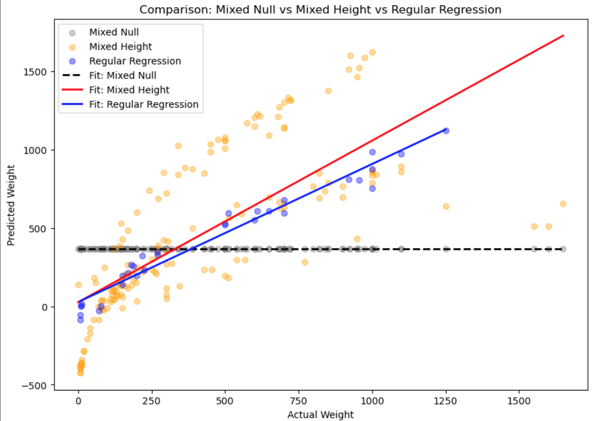

**Fish Regression Analysis Project Report Suggested Structure**

You work as a data scientist for BlueWave Seafoods, a company that needs to **estimate the *weight* of fish** arriving at port using quickly measured body dimensions. Accurate weight prediction helps optimize shipping, packaging, and pricing without having to weigh every fish individually. Your job: build a concise reproducible analysis and predictive model that estimates fish weight from simple measurements. Make sure of using the relevant statistical test under the correct assumptions.

The report should be written for an audience of **managers in the fish industry**, focusing on clarity, evidence, and interpretation. Avoid technical jargon or extensive theoretical framing — your aim is to communicate **what the data reveals about fish weight prediction.** However, **use relevant plots and tables** where applicable and add a conclusion in the end. 

**Important:** Do **not** include code in the report. All code and data analysis belong in your Jupyter notebook.

0\. **Authors of the report**

| Name | Contribution |
| :---- | :---- |
| Megan Kelly-Ortiz | Data Cleaning, Model, Report |
| Ayush Singh | Data Cleaning, Model, Report  |
| Anna Perkova | Data Cleaning, Model, Report  |
|  |   |
|  |   |

1\. **Dataset Overview** 

| Item | Description |
| :---- | :---- |
| Dataset name | Fish.csv |
| Number of rows |  159  |
| Number of columns |  7  |
| Format file (.csv, .txt, etc) |  .csv  |
| Authors of the dataset |  unknown  |
| Source (name) |  Kaggle  |
| Source (link) |  https://www.kaggle.com/datasets/vipullrathod/fish-market/data  |
| Date of Download |  27.11.2025  |

   
   
2\. **Dataset Structure** 

| Feature/variable   | Data type   | Description   |   Number of Unique values | Example values                         |
|:-------------------|:------------|:--------------|--------------------------:|:---------------------------------------|
| Species            | object      | Species of the fish |                         7 | Bream, Roach, Whitefish, Parkki, Perch |
| Weight             | float64     | Weight of the fish in grams |                       101 | 242.00, 290.00, 340.00, 363.00, 430.00 |
| Length1            | float64     | First measurement of the fish's length in cm |                       116 | 23.20, 24.00, 23.90, 26.30, 26.50      |
| Length2            | float64     | Second measurement of the fish's length in cm |                        93 | 25.40, 26.30, 26.50, 29.00, 29.70      |
| Length3            | float64     | Third measurement of the fish's length in cm |                       124 | 30.00, 31.20, 31.10, 33.50, 34.00      |
| Height             | float64     | Height of the fish in cm |                       154 | 11.52, 12.48, 12.38, 12.73, 12.44      |
| Width              | float64     | Width of the fish in cm |                       152 | 4.02, 4.31, 4.70, 4.46, 5.13           |

 

3\. **Data cleaning** 

| Issue | Names of Columns affected | Description of the Issue | Action Taken |
| :---- | :---- | :---- | :---- |
| Object type data for Model | Species | The Species column had catgories which our model cannot factor since the data type has to be numeric | Used one-hot encoding on Species  |

4\. **Descriptive statistics** 

Numeric columns

|  column |   count |   mean |    std |   min |    25% |    50% |    75% |     max |
|:--------|--------:|-------:|-------:|------:|-------:|-------:|-------:|--------:|
| Weight  |     159 | 398.33 | 357.98 |  0    | 120    | 273    | 650    | 1650    |
| Length1 |     159 |  26.25 |  10    |  7.5  |  19.05 |  25.2  |  32.7  |   59    |
| Length2 |     159 |  28.42 |  10.72 |  8.4  |  21    |  27.3  |  35.5  |   63.4  |
| Length3 |     159 |  31.23 |  11.61 |  8.8  |  23.15 |  29.4  |  39.65 |   68    |
| Height  |     159 |   8.97 |   4.29 |  1.73 |   5.94 |   7.79 |  12.37 |   18.96 |
| Width   |     159 |   4.42 |   1.69 |  1.05 |   3.39 |   4.25 |   5.58 |    8.14 |
 

Category columns

|                                  | Species   |
|:---------------------------------|:----------|
| Count                            | 159       |
| Number of unique values          | 7         |
| Most frequent value              | Perch     |
| Most frequent value (frequency)  | 56        |
| Least frequent value             | Whitefish |
| Least frequent value (frequency) | 6         |

 

**5\. Analysis \- Research question**

## Approach 1 - Mixed Effect Models

A Mixed Effect Model was also tried in two ways: a null model (with random intercept) and with Species as random effect and Height as fixed effect. The second model performed better than the null model. However, the Mixed Effect Model performed worse than the regular Regression model. It has a much higher variance of predicted variables, probably because of overfitting, so in our case the Random Forest Regressor was the most efficient.

## Approach 2 - To see if we can capture these features using a new variable (Volume = Length * Width * Height)

### Model Comparison — MAE, RMSE and R² (Volume vs Without Volume)
  

Including Volume + Species dummies drastically improves performance, reducing MAE and RMSE while slightly improving R².

---
### Linear Regression Fit — With Volume vs Without Volume
  

The model using volume aligns much closer to the true 1:1 line, indicating better predictions across the full weight range.

### Residual Distributions — Volume(Red) vs Without Volume(Blue)
  
Case 1 (Volume) residuals are tighter and more centered around zero, showing more stable error behavior.

Case 2 has longer tails and more extreme errors, suggesting missing size-related features reduce predictability.

---
### Performing the same with Random Forest Regressor (with default parameters)
  

Even with a much complex model, the performace seems to be better with lesser features

---
### Which one can we choose between Random Forest and Linear Regression?
  

#### Random Forest shows a lower MAE, meaning it produces more accurate predictions on average than Linear Regression.
#### Even though R² and RMSE are similar, RF better captures nonlinear relationships, reducing typical errors while still maintaining similar overall performance.
#### This highlights that fish weight depends on nonlinear geometry, not just linear correlations. 
--- 

### Residual Distributions — Linear Regression vs Random Forest
  

## To conclude the above statements, Across day-to-day predictions, Random Forest is more accurate than Linear Regression.
--- 
### Species-Level Stability — Average R² (Random Forest)
  
Random Forest generalizes well across species, achieving consistently high R² values.
Perch and Whitefish stand out with the highest performance, while Roach and Smelt are slightly harder to predict.

**6\. AI Disclaimer**
AI was used to fix the Mixed Effect Model code and the plots.
