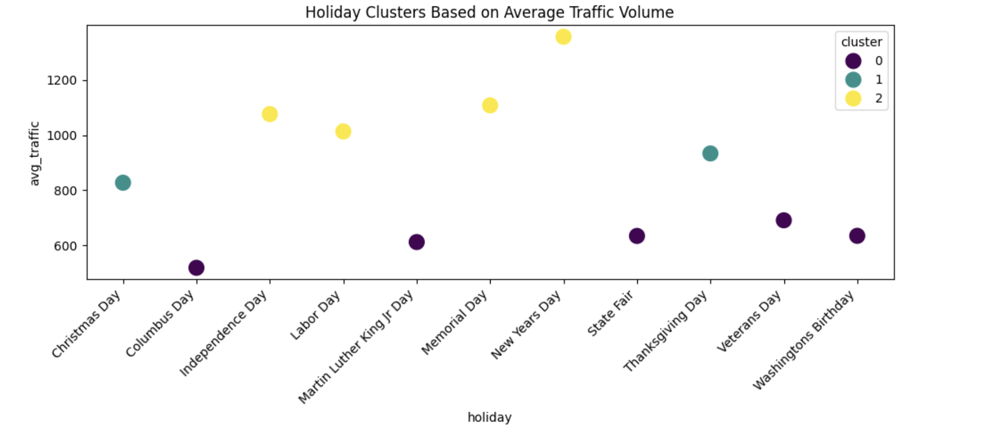
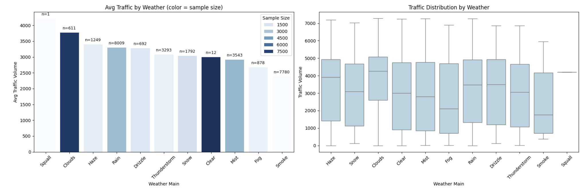
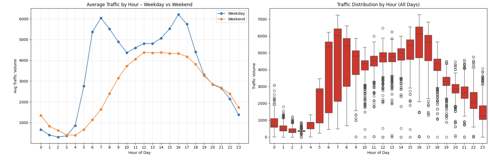
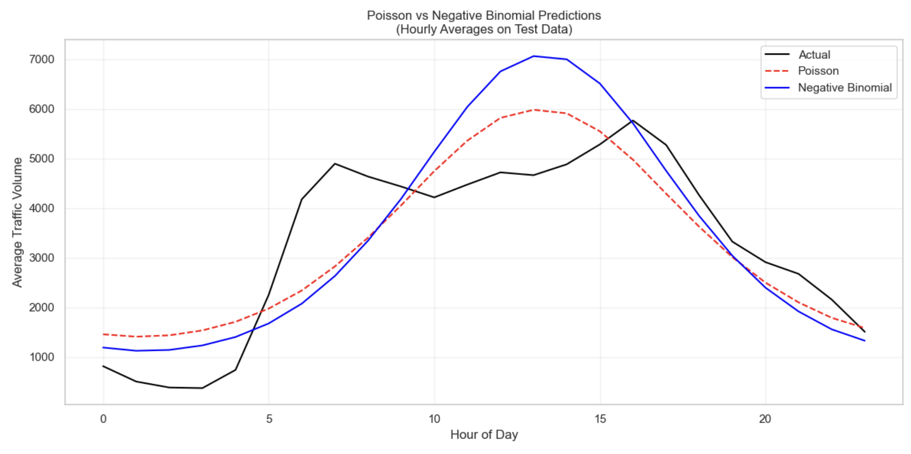
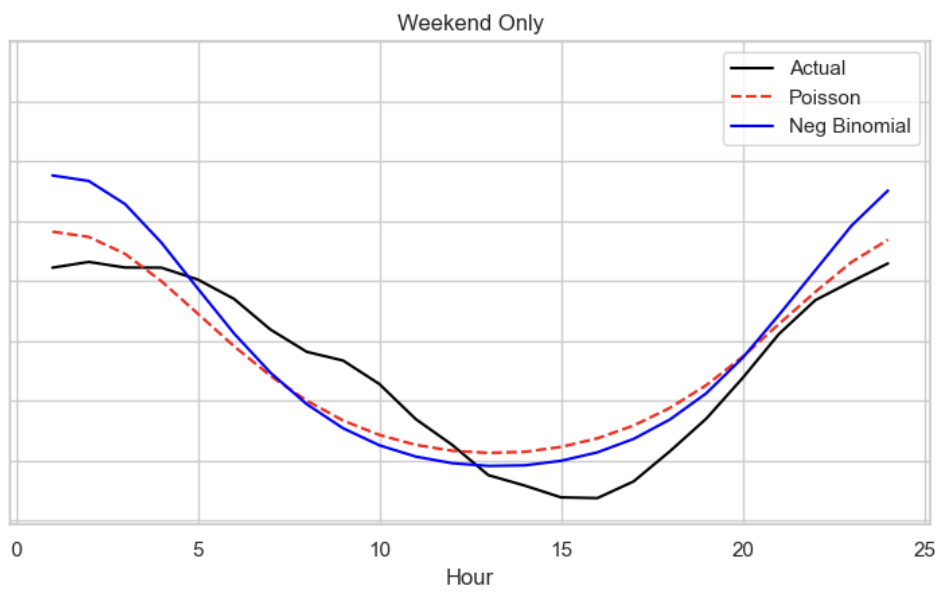
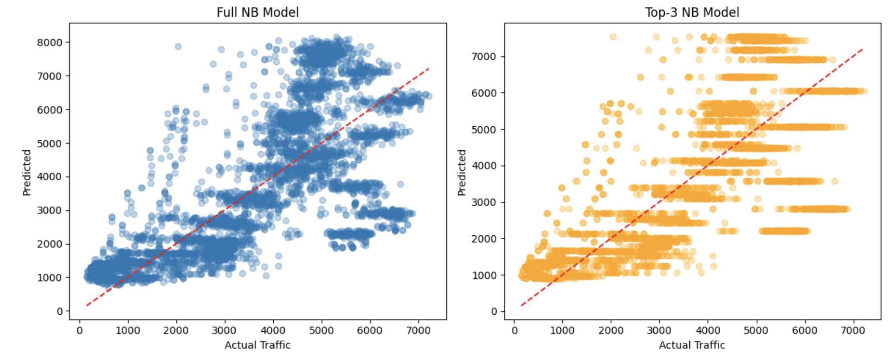
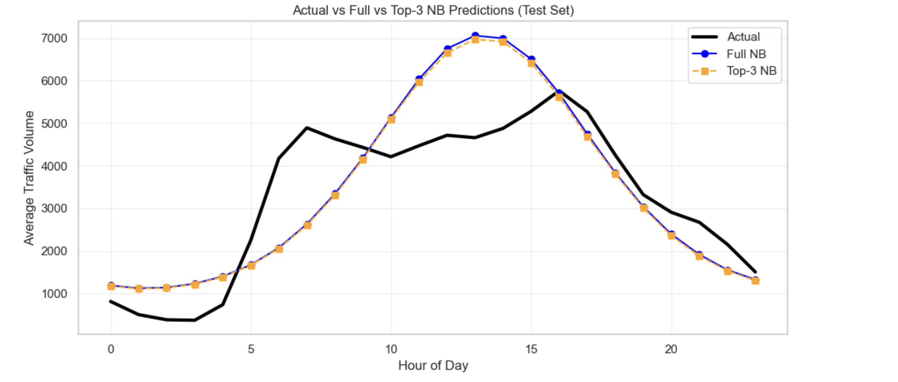
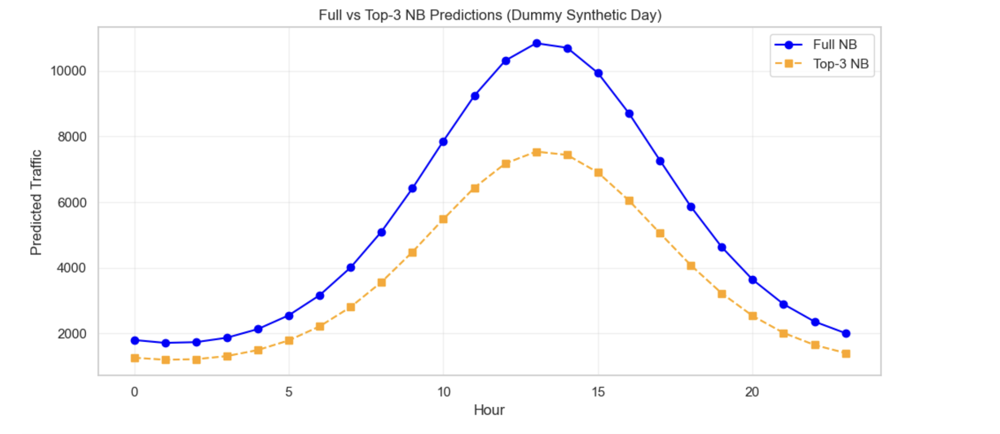

**Interstate Metro Traffic Volume**

0\. **Authors of the report**

| Name | Contribution |
| :---- | :---- |
| Megan Kelly-Ortiz | Report |
| Kush Shah | OLS diagnostics and assumption checking. |
| Ayush | Data Preprocessing & Feature reduction, Model Selection(GLMs), Visualizations, Report (3) |
| Onkar Mane | Data Processing & Visualizations   |
|  |   |

1\. **Dataset Overview** 

| Item | Description |
| :---- | :---- |
| Dataset name | Metro Interstate Traffic Volume |
| Time Period | 2012 - 2018 |
| Sampling Frequency | Hour wise data |
| Number of rows | 48204 |
| Number of columns | 9 |
| Format file (.csv, .txt, etc) | .csv |
| Creator of the dataset | John Hogue |
| Source (name) | UC Irvine Machine Learning Repository |
| Source (link) | https://archive.ics.uci.edu/dataset/492/metro+interstate+traffic+volume |

   
   
2\. **Dataset Structure** 

| Feature/variable    | Data type   | Description   |   Number of Unique values | Example values                                                                                          |
|:--------------------|:------------|:--------------|--------------------------:|:--------------------------------------------------------------------------------------------------------|
| holiday             | object      | US National holidays plus regional holiday, Minnesota State Fair              |                        11 | Columbus Day, Veterans Day, Thanksgiving Day, Christmas Day, New Years Day                              |
| temp                | float64     | Average temp in kelvin              |                      5843 | 288.28, 289.36, 289.58, 290.13, 291.14                                                                  |
| rain_1h             | float64     | Amount in mm of rain that occurred in the hour              |                       372 | 0.00, 0.25, 0.57, 0.38, 0.30                                                                            |
| snow_1h             | float64     | Amount in mm of snow that occurred in the hour              |                        12 | 0.00, 0.51, 0.32, 0.06, 0.05                                                                            |
| clouds_all          | int64       | Percentage of cloud cover              |                        60 | 40.00, 75.00, 90.00, 1.00, 20.00                                                                        |
| weather_main        | object      | Short textual description of the current weather              |                        11 | Clouds, Clear, Rain, Drizzle, Mist                                                                      |
| weather_description | object      | Longer textual description of the current weather              |                        38 | scattered clouds, broken clouds, overcast clouds, sky is clear, few clouds                              |
| date_time           | object      | Hour of the data collected in local CST time              |                     40575 | 2012-10-02 09:00:00, 2012-10-02 10:00:00, 2012-10-02 11:00:00, 2012-10-02 12:00:00, 2012-10-02 13:00:00 |
| traffic_volume      | int64       | Hourly I-94 ATR 301 reported westbound traffic volume              |                      6704 | 5545.00, 4516.00, 4767.00, 5026.00, 4918.00                                                             |

 

3\. **Data cleaning** 

| Issue | Names of Columns affected | Description of the Issue | Action Taken |
| :---- | :---- | :---- | :---- |
| Inconsistent column labeling | weather_main, holiday | Raw category strings not standardized across observations | Mapped weather and holiday categories into consistent labels |
| Wrong data types | date_time, is_weekend, holiday | Date stored as string; binary/categorical variables stored as object | Converted to datetime and numeric/categorical types |
| Time Gaps | date_time | Missing hourly timestamps due to sensor recording gaps | Used chronological split and preserved natural temporal structure |
| Duplicates | date_time, full rows | Duplicate rows present for identical timestamps | Removed duplicated records based on identical values |
| Inconsistent categories | weather_main, holiday | Rare classes and uneven distribution (e.g., Squall, Smoke, holiday imbalance) | Grouped weather categories and applied holiday clustering |
| Other | hour | Hour treated as linear despite being cyclical | Applied cyclic encoding using hour_sin and hour_cos |

4\. **Descriptive statistics** 

Numeric columns

|                                    |      temp |   rain_1h |   snow_1h |   clouds_all |   traffic_volume |
|:-----------------------------------|----------:|----------:|----------:|-------------:|-----------------:|
| count                              | 48204.000 | 48204.000 | 48204.000 |    48204.000 |        48204.000 |
| mean                               |   281.206 |     0.334 |     0.000 |       49.362 |         3259.818 |
| std                                |    13.338 |    44.789 |     0.008 |       39.016 |         1986.861 |
| min                                |     0.000 |     0.000 |     0.000 |        0.000 |            0.000 |
| 25%                                |   272.160 |     0.000 |     0.000 |        1.000 |         1193.000 |
| 50%                                |   282.450 |     0.000 |     0.000 |       64.000 |         3380.000 |
| 75%                                |   291.806 |     0.000 |     0.000 |       90.000 |         4933.000 |
| max                                |   310.070 |  9831.300 |     0.510 |      100.000 |         7280.000 |
| Variance                           |   177.908 |  2006.066 |     0.000 |     1522.229 |      3947615.324 |
| Dispersion index (Variance / Mean) |     0.633 |  6001.444 |     0.300 |       30.838 |         1210.992 |

→ add a distribution plot of your target variable.  
 
## OLS Diagnostic Results (Why OLS Is Not Appropriate)

Before fitting GLM models, a baseline Ordinary Least Squares (OLS) regression was evaluated using the same predictors.

### OLS Assumption Check Table

| OLS Assumption              | Expected                         | Observed (This Dataset)                                                | Result    |
|-----------------------------|----------------------------------|-------------------------------------------------------------------------|-----------|
| Support of Y               | Continuous, can be negative      | Count data, 235 negative predictions (min = -583.3)                    | Violated  |
| Variance (Homoskedasticity) | Var(errors) constant             | Dispersion index ≈ 1211.2, BP p-value = 0.00e+00                       | Violated  |
| Normality of errors        | Residuals ≈ Normal               | Residuals skewed / heavy-tailed (see histogram)                        | Violated  |
| Independence of errors     | No autocorrelation               | Durbin–Watson ≈ 0.49                                                   | Violated  |
| Functional form            | Additive linear effects          | Traffic reacts multiplicatively (better with log-link GLM)             | Violated  |

### Key Numbers (OLS)

- **RMSE (OLS):** 1056.58  
- **MAE (OLS):** 830.48  
- **Negative predictions:** 235 (min = -583.29)  
- **Mean(y):** 3259.62  
- **Var(y):** 3,947,988.05  
- **Var/Mean:** 1211.18  
- **Breusch–Pagan p-value:** 0.000e+00  
- **Durbin–Watson statistic:** 0.49  

### (1) Invalid Predictions for Count Data

- Traffic volume is a non-negative count variable  
- OLS produced 235 negative predictions  
- Minimum predicted value: −583  
- Count models (Poisson / NB) guarantee strictly positive predictions  

→ **OLS cannot model count data correctly**

### (2) Variance Increases With the Mean (Heteroskedasticity)

Traffic volume shows extreme over-dispersion:

- Breusch–Pagan test (p-value ≈ 0) rejects homoskedasticity  
- Residuals vs fitted plot shows a fan-shaped pattern  

→ **OLS assumption “constant variance” is violated**

### (3) Non-Normal Error Distribution)

- Residuals are skewed, heavy-tailed, and not Gaussian  
- OLS requires residuals to be approximately normal  
- Histogram clearly deviates from normality  

→ **Inference from OLS becomes unreliable**

### (4) Autocorrelation in Residuals**

- Durbin–Watson statistic ≈ 0.49  
- Indicates strong positive autocorrelation  
- Violates independence of errors  

→ **OLS cannot capture time-dependent patterns**

---
## Let's try GLM! (After some preprocessing)

- segmentation of holiday effects reveals three distinct traffic regimes driven primarily by holiday type (major annual events vs minor civic dates), implying heterogeneous behavior that would be poorly captured by a binary “holiday/non-holiday” feature.

- High-traffic cluster days (e.g., Independence Day, NYD) suggest systematic seasonal shifts in traffic demand that justify including holiday clusters as categorical predictors rather than a single holiday dummy.

- Cross-weather mean differences are modest relative to within-weather dispersion, suggesting weather acts as a low-signal, high-variance predictor rather than a primary driver of traffic volume.

- Boxplots show wide overlapping distributions, implying weak separability, consistent with weather being useful only as a secondary interaction feature rather than a standalone predictor.

- Clear bimodal peaks (morning/evening) and weekday/weekend divergence confirm the cyclical and behavioral nature of urban traffic generation—supporting sinusoid-based temporal encoding.

- The scale of diurnal variation dominates all other explanatory factors, establishing hourly periodicity as the primary determinant of traffic load in this dataset.

### Comparing Poisson vs Negative Binomial

- Poisson systematically under-predicts high-traffic periods
- Negative Binomial tracks the “shape” and “scale” more realistically
- The misfit is visible exactly where traffic has the highest variance

### Case where Poisson performs slightly better

### Why Poisson actually looks good on weekends

On weekends, the traffic curve is:
- Lower overall

- Smoother

- With smaller variance

- Fewer extreme rush-hour spikes

So the variance ≈ mean much more closely

### Can we produce same results with less features (deduced based on AIC)

- Here Z = Coefficient β​ / Standard Error(Coefficient β)

- The minimal 3-feature model (hour_cos, hour_sin, weekend) achieves nearly identical test performance to the full model, indicating that remaining predictors contribute marginal marginal explanatory power once temporal periodicity is captured.

- This implies strong functional dominance of the daily periodic structure over weather and holiday effects in predicting traffic volume, consistent with a time-driven transportation demand process.

- The model produces identical results even after removing majority of the features.

### Can we Generalize?

- Under synthetic scenarios, prediction spreads diverge substantially between full and reduced models, revealing that extra variables compensate mainly under atypical or extreme input configurations (not in standard test distributions).

- This behavior suggests conditional model vulnerability—reduced models extrapolate more aggressively since omitted variables cannot absorb scenario variation, producing larger counterfactual deviations.

---

## Conclusion

Despite reasonable RMSE and MAE, OLS:

- Produces impossible negative predictions  
- Violates homoskedasticity & normality  
- Shows autocorrelated errors  
- Fails to model multiplicative relationships  
- Ignores the count-based distribution of traffic  

**Therefore, OLS is statistically inappropriate, and GLM models (Poisson / Negative Binomial) provide a more valid modeling framework.**

**5\. Model Comparison Results**

As shown above with the plots we can conclude(exact numbers can be found in the notebook) -
Negative Binomial with predictors is superior because:

- Lowest AIC
- Highest deviance explained
- Residuals smaller
- Handles overdispersion
- Produces more realistic uncertainty estimates
- More accurate peak prediction behavior
- Poisson systematically underestimates high traffic periods and produces biased residuals due to severe overdispersion.

**6\. AI Disclaimer**
AI was used for the plots and conceptual understanding of the various parameters of both models 
