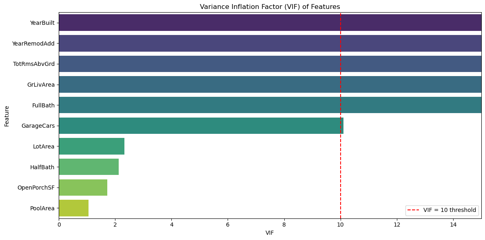
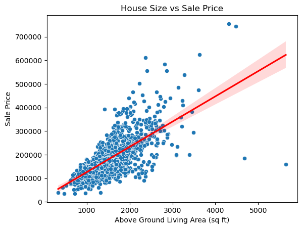
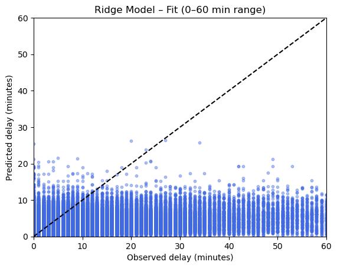

**Interstate Metro Traffic Volume**

0\. **Authors of the report**

| Name | Contribution |
| :---- | :---- |
| Megan Kelly-Ortiz | Data preprocessing, GLM, Visulatizations, Report |
| Anna Perkova | Data preprocessing, GLM, Visulatizations, Report |
| Ayush | Data preprocessing, Random Forest Model, Visulatizations|
|  |   |
|  |   |
|  |   |

1\. **Dataset Overview** 

| Item | Description |
| :---- | :---- |
| Dataset name | Housing |
| Time Period | N/A |
| Number of rows | 1460 |
| Number of columns | 81 |
| Format file (.csv, .txt, etc) | .csv |
| Creator of the dataset | N/A |
| Source (name) | ASDA GitHub |
| Source (link) | N/A |

2\. **Dataset Structure** 

An initial selection of variables was made based on domain knowledge and check of category balance, with the selected features as follows:

| Feature/variable   | Data type   | Description   |   Number of Unique values | Example values                                        |
|:-------------------|:------------|:--------------|--------------------------:|:------------------------------------------------------|
| SalePrice          | int64       |               |                       663 | 208500.00, 181500.00, 223500.00, 140000.00, 250000.00 |
| LotArea            | int64       |               |                      1073 | 8450.00, 9600.00, 11250.00, 9550.00, 14260.00         |
| Neighborhood       | object      |               |                        25 | CollgCr, Veenker, Crawfor, NoRidge, Mitchel           |
| HouseStyle         | object      |               |                         8 | 2Story, 1Story, 1.5Fin, 1.5Unf, SFoyer                |
| YearBuilt          | int64       |               |                       112 | 2003.00, 1976.00, 2001.00, 1915.00, 2000.00           |
| YearRemodAdd       | int64       |               |                        61 | 2003.00, 1976.00, 2002.00, 1970.00, 2000.00           |
| Heating            | object      |               |                         6 | GasA, GasW, Grav, Wall, OthW                          |
| CentralAir         | object      |               |                         2 | Y, N                                                  |
| TotRmsAbvGrd       | int64       |               |                        12 | 8.00, 6.00, 7.00, 9.00, 5.00                          |
| FullBath           | int64       |               |                         4 | 2.00, 1.00, 3.00, 0.00                                |
| HalfBath           | int64       |               |                         3 | 1.00, 0.00, 2.00                                      |
| GrLivArea          | int64       |               |                       861 | 1710.00, 1262.00, 1786.00, 1717.00, 2198.00           |
| GarageCars         | int64       |               |                         5 | 2.00, 3.00, 1.00, 0.00, 4.00                          |
| PoolArea           | int64       |               |                         8 | 0.00, 512.00, 648.00, 576.00, 555.00                  |
| OpenPorchSF        | int64       |               |                       202 | 61.00, 0.00, 42.00, 35.00, 84.00                      |

3\. **Data cleaning** 

Since the selected features did not contain missing values and duplicates, data cleaning was not necessary. Categorical variables were encoded into dummy variables automatically by the models.

4\. **Descriptive statistics** 

Numeric columns

|                                    |      LotArea |   YearBuilt |   YearRemodAdd |   TotRmsAbvGrd |   FullBath |   HalfBath |   GrLivArea |   GarageCars |   PoolArea |   OpenPorchSF |
|:-----------------------------------|-------------:|------------:|---------------:|---------------:|-----------:|-----------:|------------:|-------------:|-----------:|--------------:|
| count                              |     1460.000 |    1460.000 |       1460.000 |       1460.000 |   1460.000 |   1460.000 |    1460.000 |     1460.000 |   1460.000 |      1460.000 |
| mean                               |    10516.828 |    1971.268 |       1984.866 |          6.518 |      1.565 |      0.383 |    1515.464 |        1.767 |      2.759 |        46.660 |
| std                                |     9981.265 |      30.203 |         20.645 |          1.625 |      0.551 |      0.503 |     525.480 |        0.747 |     40.177 |        66.256 |
| min                                |     1300.000 |    1872.000 |       1950.000 |          2.000 |      0.000 |      0.000 |     334.000 |        0.000 |      0.000 |         0.000 |
| 25%                                |     7553.500 |    1954.000 |       1967.000 |          5.000 |      1.000 |      0.000 |    1129.500 |        1.000 |      0.000 |         0.000 |
| 50%                                |     9478.500 |    1973.000 |       1994.000 |          6.000 |      2.000 |      0.000 |    1464.000 |        2.000 |      0.000 |        25.000 |
| 75%                                |    11601.500 |    2000.000 |       2004.000 |          7.000 |      2.000 |      1.000 |    1776.750 |        2.000 |      0.000 |        68.000 |
| max                                |   215245.000 |    2010.000 |       2010.000 |         14.000 |      3.000 |      2.000 |    5642.000 |        4.000 |    738.000 |       547.000 |
| Variance                           | 99625649.650 |     912.215 |        426.233 |          2.642 |      0.304 |      0.253 |  276129.633 |        0.558 |   1614.216 |      4389.861 |
| Dispersion index (Variance / Mean) |     9472.975 |       0.463 |          0.215 |          0.405 |      0.194 |      0.661 |     182.208 |        0.316 |    585.093 |        94.081 |

Categorical variables

|              |   Unique Values | Most Frequent   |   Frequency |   Percentage |
|:-------------|----------------:|:----------------|------------:|-------------:|
| Neighborhood |              25 | NAmes           |      225.00 |        15.41 |
| HouseStyle   |               8 | 1Story          |      726.00 |        49.73 |
| Heating      |               6 | GasA            |     1428.00 |        97.81 |
| CentralAir   |               2 | Y               |     1365.00 |        93.49 |

5\. **What Makes a Home More Expensive in Ames? A Data-Driven Guide for Home Buyers** 

This report presents a statistical analysis of the Ames housing dataset to identify the most significant predictors of home prices in Ames, Iowa. Using a minimum adequate model selection approach, we identify the key variables that drive property values, providing prospective buyers with data-driven insights into the factors that most strongly influence home prices. In the process of choosing the final model, 3 different models were built independently and assessed based on statistical measures such as RMSE, R^2, and AIC(where applicable). 

**Methodology**
The process began with an analysis of approximately 80 variables. Using domain knowledge and statistical methods, we reduced the initial set to 15 variables, and the final model included the following 5 variables:

* Neighborhood: Categorical variable capturing location-based value differentials
* Above-ground living area (GrLivArea): Continuous variable measuring total square footage of finished living space
* Year built: Continuous variable indicating construction date
* Full bathrooms: Continuous variable counting complete bathrooms
* Half bathrooms: Continuous variable counting half bathrooms

This selection was guided by several statistical criteria:
1. Multicollinearity assessment: Variance Inflation Factors (VIF) were calculated to identify and remove highly correlated predictors.

2. Chi-square tests: For categorical variables, we assessed associations between predictors to avoid redundancy.
3. Model reduction: We prioritized a minimum adequate model that balances explanatory power with simplicity.

**Model Specification and Estimation**
We employed Generalized Linear Modeling (GLM) to estimate the relationship between predictors and log-transformed sale prices. 
The log transformation was applied to address heteroscedasticity and improve model fit. 

The model's performance was evaluated using multiple metrics:

| Model                   |     AIC |   Validation RMSE |   Validation R² |
|:------------------------|--------:|------------------:|----------------:|
| Model 1 (Random Forest) |   nan   |       8.34463e+08 |            0.89 |
| Model 2 (GLM)           | 27619.9 |   42935.4         |            0.76 |
| Final Model (GLM)       | 24554.7 |   37500.5         |            0.82 |

The final model was selected by comparing predictive accuracy, overall model fit. Although the Random Forest model achieved a high validation R^2 of 0.89, its extremely large validation RMSE indicates unstable price predictions. Model 2 offered a much lower RMSE, while the final GLM has the lowest AIC, a reduced validation RMSE of 37,500.5, and an increased validation R^2 of 0.82, demonstrating better generalization to unseen data.

These metrics indicate strong predictive performance, with the final model explaining approximately 82% of the variance in validation data. The plot reveals the model performs well for mid-range homes. It has larger errors for very high-priced homes, suggesting that extreme values are harder to predict accurately. Overall, the scatter plot confirms that the GLM captures the main trends in the data.

The analysis shows that several key factors strongly influence house sale prices. Unsurprisingly, house size is one of the most important predictors—larger homes generally sell for much more, with a 1,000 square foot increase translating to roughly a 50% higher price. 

Newer homes tend to have higher prices, as shown in the plot below. 

Neighborhood is another major factor: homes in highly desirable areas like NridgHt, StoneBr, and Veenker sell for significantly more, while homes in neighborhoods such as BrDale, MeadowV, and IDOTRR tend to sell for less, reflecting the impact of location, local amenities, and overall appeal. 

The model itself performs very well. It explains around 97% of the variation in sale prices on the training data and nearly 99% on the test data, showing that it generalizes well to new observations. Key predictors like living area, house age, and lot size remain strong, while neighborhood effects are a little more variable but still consistent for the most high- and low-value areas. Overall, the results suggest that buyers place the most value on spacious, newer homes in desirable neighborhoods, with lot size and other features playing supporting roles.

**Model Limitations and Assumptions**

Diagnostic plots revealed some violations of the statistical assumptions, particularly heteroscedasticity and non-normality of residuals, which may affect inference.

**Model Limitations**
1. Omitted variable bias: The model excludes many potentially relevant variables (e.g., school quality, proximity to amenities)
2. Non-linear relationships: The linear model may not capture complex interactions between variables
3. Temporal effects: The model does not account for market trends over time
4. Outliers: Extreme values may disproportionately influence parameter estimates

**Model Reduction Approach**
Our model reduction approach followed a systematic process:
1. Initial variable selection based on domain knowledge
2. Multicollinearity assessment using VIF
3. Chi-square testing for categorical variables
4. Iterative refinement based on statistical significance and model fit
This approach prioritized a minimum adequate model that balances explanatory power with simplicity, avoiding overfitting while maintaining predictive accuracy.

**Conclusion**
This analysis shows that home prices in Ames are largely driven by house size, age, and location. Larger homes with more living space sell for higher prices, and newer homes tend to have higher prices as well. Neighborhood remains an important factor, with homes in highly desirable areas like NridgHt, StoneBr, and Veenker selling for substantially more than similar homes in less sought-after neighborhoods such as BrDale, MeadowV, or IDOTRR. In comparison, features like the number of bathrooms have a smaller impact on price once other factors are considered.

While the model provides a strong indication of what drives sale prices, buyers should also consider additional factors not captured here, such as school quality, local amenities, and current market conditions. Overall, the model offers a useful, data-driven perspective for evaluating properties and understanding pricing trends in Ames.

**6\. AI Disclaimer**
AI was used for the plots and conceptual understanding of the various parameters of the models 