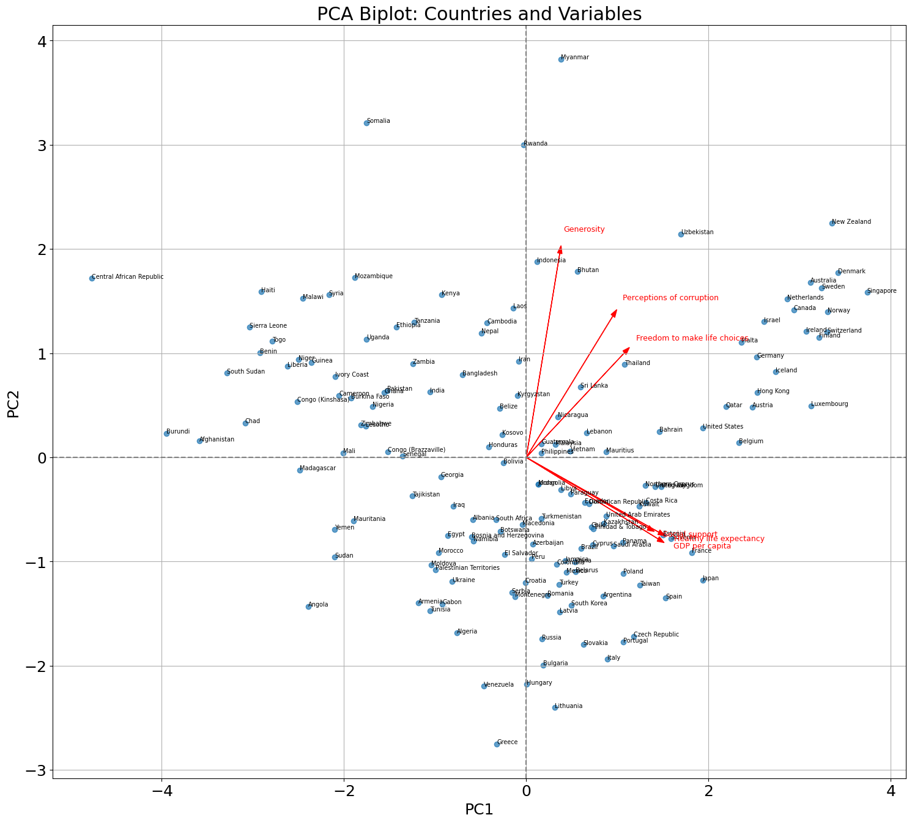
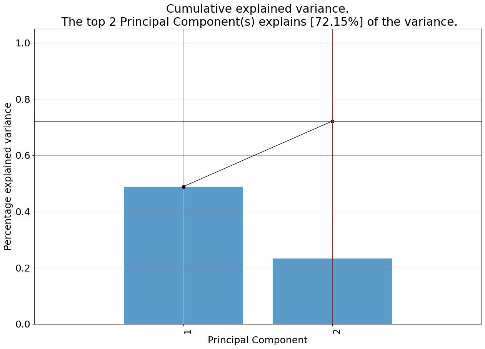
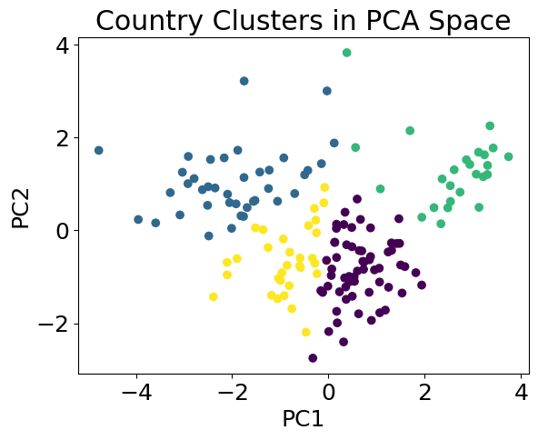
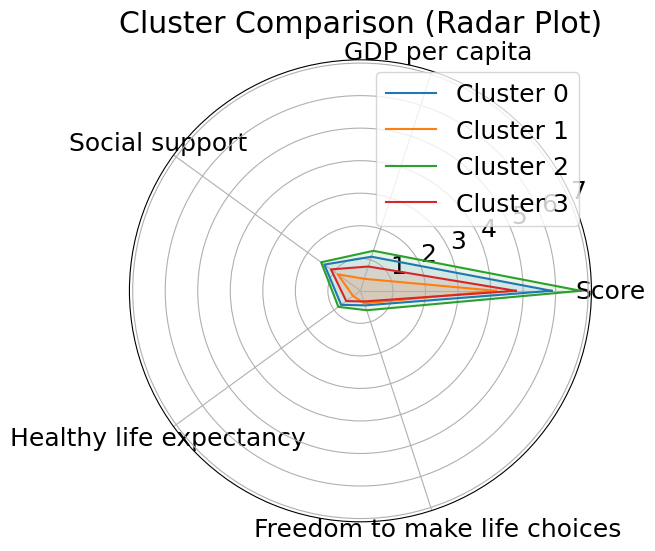

**Happiness Ordination**

**Authors of the report**

| Name | Contribution |
| :---- | :---- |
| Megan Kelly-Ortiz | Report, PCA, Visualizations |
| Anna Perkova | PCA, Clusters |
| Ayush | Visualize PCA with PLotly |

1\. **Introduction** 

2\. **Dataset Overview** 

| Item | Description |
| :---- | :---- |
| Dataset name | Happiness Dataset |
| Number of rows | 156 |
| Number of columns | 9 |
| Format file (.csv, .txt, etc) | .csv |
| Source (name) | ASAD Github |
| Source (link) | https://github.com/datagus/ASDA2025/tree/main/datasets/homework_week10 |
| Date of Download | 18.12.2025 |

3\. **Dataset Structure** 

<strong>Click to view columns of the data set</strong>

  

|                                    |   Score |   GDP per capita |   Social support |   Healthy life expectancy |   Freedom to make life choices |   Generosity |   Perceptions of corruption |
|:-----------------------------------|--------:|-----------------:|-----------------:|--------------------------:|-------------------------------:|-------------:|----------------------------:|
| count                              |  156.00 |           156.00 |           156.00 |                    156.00 |                         156.00 |       156.00 |                      156.00 |
| mean                               |    5.38 |             0.89 |             1.21 |                      0.60 |                           0.45 |         0.18 |                        0.11 |
| std                                |    1.12 |             0.39 |             0.30 |                      0.25 |                           0.16 |         0.10 |                        0.10 |
| min                                |    2.90 |             0.00 |             0.00 |                      0.00 |                           0.00 |         0.00 |                        0.00 |
| 25%                                |    4.45 |             0.62 |             1.07 |                      0.42 |                           0.36 |         0.11 |                        0.05 |
| 50%                                |    5.38 |             0.95 |             1.25 |                      0.64 |                           0.49 |         0.17 |                        0.08 |
| 75%                                |    6.17 |             1.20 |             1.46 |                      0.78 |                           0.58 |         0.24 |                        0.14 |
| max                                |    7.63 |             2.10 |             1.64 |                      1.03 |                           0.72 |         0.60 |                        0.46 |
| Variance                           |    1.25 |             0.15 |             0.09 |                      0.06 |                           0.03 |         0.01 |                        0.01 |
| Dispersion index (Variance / Mean) |    0.23 |             0.17 |             0.08 |                      0.10 |                           0.06 |         0.05 |                        0.08 |

4\. **Data cleaning** 

5\. **Descriptive statistics** 

<strong>Numeric Columns
</strong>

  

Numeric columns

|                              |   count |   mean |   std |   min |   25% |   50% |   75% |   max |   Variance |   Dispersion index (Variance / Mean) |
|:-----------------------------|--------:|-------:|------:|------:|------:|------:|------:|------:|-----------:|-------------------------------------:|
| Score                        |  156.00 |   5.38 |  1.12 |  2.90 |  4.45 |  5.38 |  6.17 |  7.63 |       1.25 |                                 0.23 |
| GDP per capita               |  156.00 |   0.89 |  0.39 |  0.00 |  0.62 |  0.95 |  1.20 |  2.10 |       0.15 |                                 0.17 |
| Social support               |  156.00 |   1.21 |  0.30 |  0.00 |  1.07 |  1.25 |  1.46 |  1.64 |       0.09 |                                 0.08 |
| Healthy life expectancy      |  156.00 |   0.60 |  0.25 |  0.00 |  0.42 |  0.64 |  0.78 |  1.03 |       0.06 |                                 0.10 |
| Freedom to make life choices |  156.00 |   0.45 |  0.16 |  0.00 |  0.36 |  0.49 |  0.58 |  0.72 |       0.03 |                                 0.06 |
| Generosity                   |  156.00 |   0.18 |  0.10 |  0.00 |  0.11 |  0.17 |  0.24 |  0.60 |       0.01 |                                 0.05 |
| Perceptions of corruption    |  156.00 |   0.11 |  0.10 |  0.00 |  0.05 |  0.08 |  0.14 |  0.46 |       0.01 |                                 0.08 |

<strong>Categorical columns
</strong>

  

Categorical variables

|   Variale Name    |   Unique Values |
|:------------------|----------------:|
| Country or region |             156 |

6\. **Principal Component Analysis**

The PCA revealed that PC1 (x-axis) explains 48.8% of the variance, while PC2 (y-axis) explains 23.2% of the variance. Together, the top 2 components explain 72.15% of the total variance in your data.

### Interactive plots

#### 3D PCA biplot segmented on countries
[Open interactive 3D PCA biplot](https://htmlpreview.github.io/?https://github.com/kellymegan/ASDA_2025_Group_2_Portfolio_/blob/main/additional_materials/pca_3d_biplot.html)

#### PC1 Across each country
[Open interactive world map of the happiness gradient (PC1)](https://htmlpreview.github.io/?https://github.com/kellymegan/ASDA_2025_Group_2_Portfolio_/blob/main/additional_materials/pc1_world_map.html)

### Country clusters

Based on the PCA results, countries can be clustered as follows:

Comparison of clusters shows that they tend to perform equally higher or lower consistently over most of the indicators:

