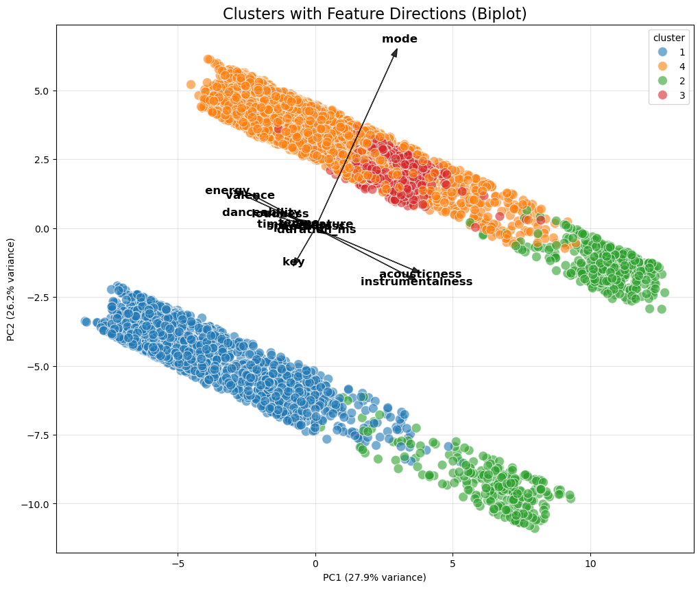
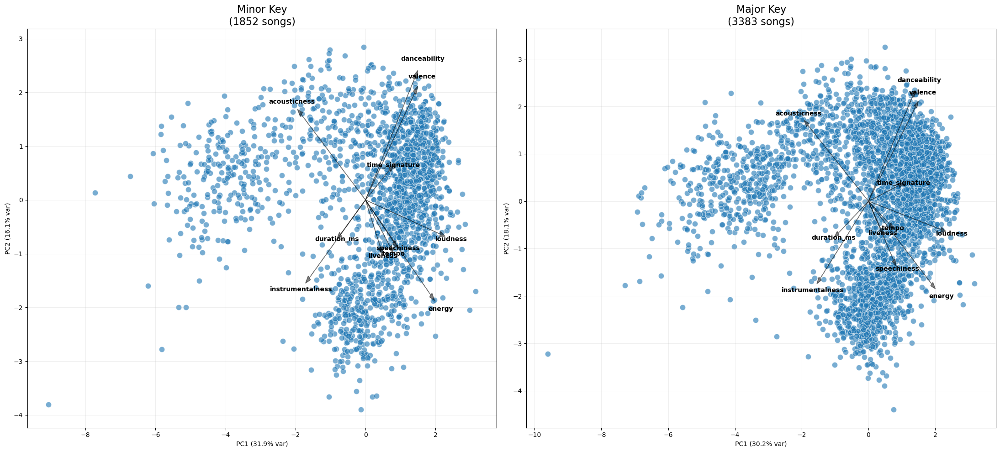

# Spotify Songs Clustering Report

---

## Authors and Contributions

| Name | Contribution |
|------|-------------|
| Kush Shah | Report |
| Megan Kelly Ortiz | Clustering, PCA |
| Anna Perkova | Visualization, Playlists |

---

## 1. Introduction

Playlists play a central role in music discovery on streaming platforms such as Spotify. Traditionally, playlist curation relies on expert editors who group songs based on musical intuition and listening experience. However, the availability of detailed audio features provides an opportunity to support playlist creation using data-driven methods.

The objective of this project is to cluster Spotify songs using their audio features in order to design playlists that are musically coherent and distinct. By applying dimensionality reduction and clustering techniques, the project aims to translate numerical audio characteristics into meaningful listening experiences.

---

## 2. Dataset Overview

| Attribute | Description |
|---------|-------------|
| Dataset name | Spotify Songs Dataset |
| Number of songs | 5,235 |
| Number of columns | 17 |
| Unit of observation | Individual song |
| Audio features | 12 numerical audio features |
| Metadata fields | Song name, artist, track ID, Spotify link |
| File format | CSV |
| Source | Github |
| Primary use | Song clustering and playlist design |
| Date of Download | 08.01.2026|

---

## 3. Dataset Structure

Each row in the dataset represents a single song, while columns correspond to audio features and metadata.

<strong>List of audio features used for clustering</strong>

| Feature | Description |
|--------|-------------|
| danceability | Suitability of a track for dancing |
| energy | Intensity and activity level |
| loudness | Overall loudness of a track (dB) |
| speechiness | Presence of spoken words |
| acousticness | Likelihood of acoustic sound |
| instrumentalness | Degree of instrumental content |
| liveness | Presence of live audience |
| valence | Musical positivity |
| tempo | Estimated beats per minute (BPM) |
| duration_ms | Track length in milliseconds |

Metadata variables such as song name, artist, track ID, and Spotify URL were retained for interpretation and presentation purposes but excluded from the clustering process.

---

## 4. Data Cleaning

Before analysis, several preprocessing steps were applied to ensure data quality and consistency.

| Issue Identified | Affected Columns | Action Taken |
|------------------|------------------|--------------|
| Inconsistent column names | All columns | Removed leading and trailing whitespaces |
| Mixed data types | Audio features | Ensured numerical data types |
| Feature scaling | Numerical features | Standardized using z-score normalization |
| Non-informative variables | Metadata columns | Excluded from clustering |

These steps ensured that all features contributed equally to distance-based clustering methods.

---

## 5. Exploratory Data Analysis

<strong>Click to collapse/expand descriptive statistics of audio features</strong>

|                  |   min |           max |       mean |        std |
|------------------|------:|--------------:|-----------:|-----------:|
| danceability     |     0 |   0.967       |      0.51  |      0.218 |
| energy           |     0 |   1           |      0.654 |      0.288 |
| loudness         |   -60 |   1.342       |     -9.338 |      6.295 |
| acousticness     |     0 |   0.996       |      0.29  |      0.356 |
| instrumentalness |     0 |   0.985       |      0.257 |      0.371 |
| valence          |     0 |   0.985       |      0.444 |      0.278 |
| tempo            |     0 | 213.99        |    118.721 |     28.568 |
| duration_ms      | 32760 |   3.81579e+06 | 247911     | 135633     |

The descriptive statistics indicate substantial variability across audio features. 
Energy, acousticness, and instrumentalness span wide ranges, reflecting diverse musical styles within the dataset. 
Such variability supports the application of dimensionality reduction and clustering techniques in subsequent analysis.

---

## 6. Hierarchical clustering

The song library was grouped using Hierarchical Clustering to identify natural distinct categories. The dendrogram displayed the Euclidean distances between songs based on their audio features. A cut point was selected where the tree branched into six primary vertical lines. This level was chosen because it represents a major, but still detailed enough structural division in the data before the groups fragment into smaller, less distinguishable sub-clusters.

---

## 7. Principal Component Analysis (PCA)

Principal Component Analysis (PCA) was used to visualize the variance within these groups. The initial biplot included the key feature, which created two parallel strips of data separated by a significant gap. This separation was artificial, as it segregated stylistically similar songs solely based on pitch class. 

Removing key eliminated the wide gap, though a diagonal separation remained due to the mode feature (Major VS Minor). This confirmed that harmonic variables were dominating the spatial distribution, potentially obscuring other relevant stylistic features like energy or valence.

## 7. Analysing Parallel Subframe Plots

To verify if separate clustering models were needed for Major and Minor keys, we performed a stratified analysis. The side-by-side plots of the df_minor and df_major subsets allowed us to see the interrelation of other features and revealed that the distribution remains consistent across both modes. For example, high energy and loudness correlate negatively with acousticness in both subsets. Since the internal relationships between features are stable regardless of key, the original global clustering model is valid and separate models for each mode are unnecessary.

---

## 8. Playlist Interpretation & Sample Songs

To translate clustering results into an editorial context, each cluster was interpreted as a playlist representing a distinct listening experience. For each cluster, a small sample of representative songs was selected to illustrate the playlist concept.

Metalhead: https://open.spotify.com/playlist/3Or9Vyh2ROdp0VeTyK9QHp 

Pop beats: https://open.spotify.com/playlist/5pYjlksEzypQT0k0etmp6o 

Golden classics: https://open.spotify.com/playlist/3CrfeMUi72egTcJchPmp21 

Jazz for Two: https://open.spotify.com/playlist/4hOq83I5NGalxOeWjbVWtb 

Clubbing hard: https://open.spotify.com/playlist/30kr6RA5LNr705N4fQF8BH 

RnB Groove: https://open.spotify.com/playlist/6ykvEls1OEid43U4hBgqd3 

---

## 9. AI Disclaimer

AI was used for the plots and conceptual understanding of the various parameters of both models

---

