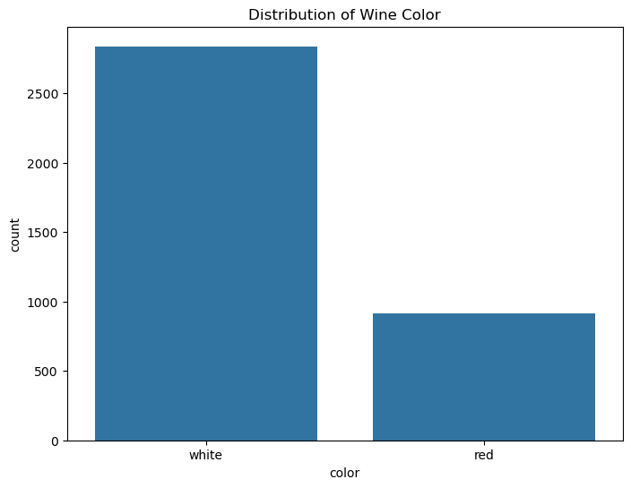

**Wine Color Classification**

**Authors of the report**

| Name | Contribution |
| :---- | :---- |
|  |  |
| Anna Perkova | Report |
|  |  |
|  |  |
|  |  |
|  |  |

1\. **Introduction** 

2\. **Dataset Overview** 

| Item | Description |
| :---- | :---- |
| Dataset name | Wine development |
| Number of rows | 3751 |
| Number of columns | 14 |
| Format file (.csv, .txt, etc) | .csv |
| Source (name) | ASDA |
| Source (link) | https://leuphanalg-my.sharepoint.com/:x:/g/personal/jannik_j_schneider_stud_leuphana_de/IQDoZoik1LNpTZVc5m2-Q7O7ARnWfJCqmT_5YwSpi4WfuMo?e=1hiOhO  |
| Date of Download | 15.01.2026 |

3\. **Dataset Structure** 

<strong>Click to view columns of the data set</strong>

  

|                                    |   fixed acidity |   volatile acidity |   citric acid |   residual sugar |   chlorides |   free sulfur dioxide |   total sulfur dioxide |   density |      pH |   sulphates |   alcohol |   quality |    wine_id |
|:-----------------------------------|----------------:|-------------------:|--------------:|-----------------:|------------:|----------------------:|-----------------------:|----------:|--------:|------------:|----------:|----------:|-----------:|
| count                              |         3948.00 |            3948.00 |       3948.00 |          3948.00 |     3948.00 |               3948.00 |                3948.00 |   3948.00 | 3948.00 |     3948.00 |   3948.00 |   3948.00 |    3948.00 |
| mean                               |            7.20 |               0.34 |          0.32 |             5.40 |        0.06 |                 30.36 |                 115.53 |      0.99 |    3.22 |        0.53 |     10.49 |      5.83 |    2577.78 |
| std                                |            1.30 |               0.17 |          0.14 |             4.74 |        0.03 |                 17.45 |                  55.93 |      0.00 |    0.16 |        0.15 |      1.19 |      0.88 |    1442.33 |
| min                                |            3.90 |               0.08 |          0.00 |             0.60 |        0.01 |                  1.00 |                   6.00 |      0.99 |    2.74 |        0.22 |      8.00 |      3.00 |     110.00 |
| 25%                                |            6.40 |               0.22 |          0.25 |             1.80 |        0.04 |                 17.00 |                  78.00 |      0.99 |    3.11 |        0.43 |      9.50 |      5.00 |    1321.75 |
| 50%                                |            7.00 |               0.29 |          0.31 |             3.00 |        0.05 |                 29.00 |                 118.00 |      0.99 |    3.21 |        0.51 |     10.30 |      6.00 |    2574.50 |
| 75%                                |            7.70 |               0.40 |          0.39 |             8.10 |        0.06 |                 41.00 |                 155.00 |      1.00 |    3.32 |        0.60 |     11.30 |      6.00 |    3816.25 |
| max                                |           15.90 |               1.33 |          1.66 |            65.80 |        0.61 |                138.50 |                 313.00 |      1.04 |    3.90 |        1.95 |     14.90 |      9.00 |    5085.00 |
| Variance                           |            1.70 |               0.03 |          0.02 |            22.50 |        0.00 |                304.40 |                3128.35 |      0.00 |    0.03 |        0.02 |      1.42 |      0.77 | 2080314.05 |
| Dispersion index (Variance / Mean) |            0.24 |               0.08 |          0.06 |             4.17 |        0.02 |                 10.02 |                  27.08 |      0.00 |    0.01 |        0.04 |      0.14 |      0.13 |     807.02 |

 

4\. **Descriptive statistics** 

<strong>Numeric Columns
</strong>

  

| Feature/variable     | Data type   |   Number of Unique values | Example values                              |
|:---------------------|:------------|--------------------------:|:--------------------------------------------|
| fixed acidity        | float64     |                       102 | 5.80, 6.30, 8.20, 9.40, 5.30                |
| volatile acidity     | float64     |                       167 | 0.31, 0.13, 0.30, 0.17, 0.24                |
| citric acid          | float64     |                        87 | 0.32, 0.42, 0.44, 0.55, 0.16                |
| residual sugar       | float64     |                       282 | 4.50, 1.10, 12.40, 1.60, 4.20               |
| chlorides            | float64     |                       179 | 0.02, 0.04, 0.05, 0.03, 0.05                |
| free sulfur dioxide  | float64     |                       117 | 28.00, 63.00, 52.00, 14.00, 37.00           |
| total sulfur dioxide | float64     |                       256 | 94.00, 146.00, 154.00, 100.00, 174.00       |
| density              | float64     |                       852 | 0.99, 0.99, 0.99, 0.99, 0.99                |
| pH                   | float64     |                       100 | 3.25, 3.13, 3.04, 3.02, 3.30                |
| sulphates            | float64     |                       100 | 0.52, 0.72, 0.33, 0.61, 0.36                |
| alcohol              | float64     |                        99 | 13.70, 11.20, 12.00, 10.30, 11.80           |
| quality              | int64       |                         7 | 7.00, 6.00, 8.00, 5.00, 4.00                |
| color                | object      |                         2 | white, red                                  |
| wine_id              | int64       |                      3751 | 1198.00, 3409.00, 4789.00, 3054.00, 2812.00 |

 

<strong>Categorical columns
</strong>

  

|       |   Unique Values |
|:------|----------------:|
| color |               2 |

 

5\. **Data exploration**

The dataset is clearly imbalanced, with significantly more white wines than red wines, which justifies using stratified splits and evaluation metrics beyond accuracy. This imbalance also motivated careful cross-validation to ensure the SVM did not simply favor the majority class.

OneClassSVM model flagged 197 wines as statistically unusual, which suggests the dataset contains 5.5% of atypical samples.

6\. **Principal Component Analysis**

All features were standardized before applying PCA, which is necessary for SVMs and PCA because the variables are on different scales. The PCA plot shows a strong separation between red and white wines, suggesting that a linear or mildly non-linear SVM should perform well and that a few dominant feature combinations already capture most of the class differences.

7\. **Support Vector Machine**

The final SVM achieved a very high cross-validation score (≈0.995) and test accuracy (≈0.997), with near-perfect precision and recall for both classes, indicating excellent generalization. Based on the PCA structure and SVM weights, features related to *alcohol content, density, sulphates, and acidity* appear more influential than others, as they contribute most to the separation between wine colors.

8\. **AI Disclaimer**

AI was used to assist with conceptualizations and plots.
